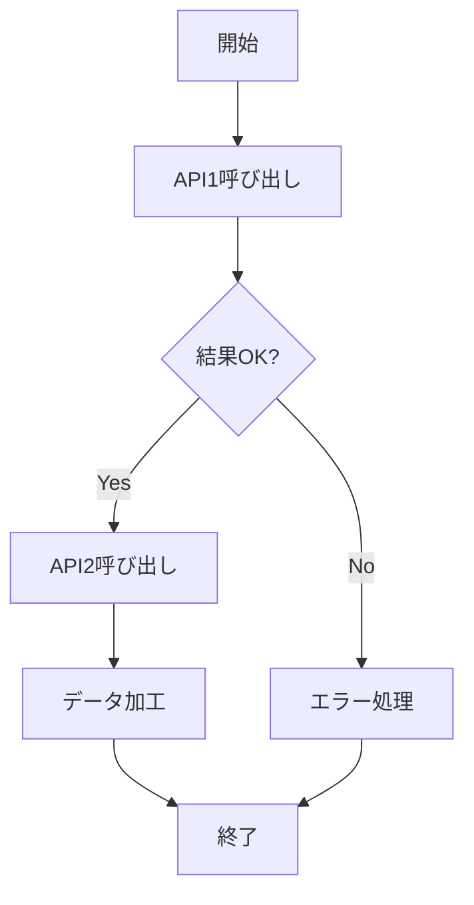

# Rust 非同期プログラミング完全ガイド

[[async-await]] は Rust の強力な機能です。[[thread]]との違いを理解し、適切に活用することが重要です。

## 非同期プログラミングとは

```rust
// 同期版
fn fetch_data() -> String {
    std::thread::sleep(std::time::Duration::from_secs(1));
    "data".to_string()
}

// 非同期版
async fn fetch_data_async() -> String {
    tokio::time::sleep(std::time::Duration::from_secs(1)).await;
    "data".to_string()
}
```

:::message[非同期の強み]{success}
非同期プログラミングでは、待機中にスレッドが他のタスクを処理できます。少数のスレッドで多数のタスクを処理でき、リソース効率が優れています。
:::

## 複数のタスク実行

```rust
#[tokio::main]
async fn main() {
    let task1 = tokio::spawn(async {
        println!("Task 1 start");
        tokio::time::sleep(std::time::Duration::from_secs(1)).await;
        println!("Task 1 end");
    });
    
    let task2 = tokio::spawn(async {
        println!("Task 2 start");
        tokio::time::sleep(std::time::Duration::from_secs(2)).await;
        println!("Task 2 end");
    });
    
    tokio::try_join!(task1, task2).unwrap();
}
```

実行結果：

```
Task 1 start
Task 2 start
Task 1 end      (1秒後)
Task 2 end      (2秒後)
```

## 非同期関数の組み合わせ



上記フローを実装します：

```rust
async fn workflow() -> Result<String, Box<dyn std::error::Error>> {
    let result1 = call_api1().await?;
    let result2 = call_api2(&result1).await?;
    let processed = process_data(result2);
    Ok(processed)
}

async fn call_api1() -> Result<String, Box<dyn std::error::Error>> {
    // API呼び出し
    Ok("data1".to_string())
}

async fn call_api2(input: &str) -> Result<String, Box<dyn std::error::Error>> {
    // API呼び出し
    Ok(format!("processed: {}", input))
}

fn process_data(data: String) -> String {
    data.to_uppercase()
}
```

:::details[thread との使い分け]
- **非同期（async/await）**: I/O 処理が多い場合。数千のコンカレント接続。
- **[[thread]]**: CPU バウンドな処理。計算量が多い場合。

```rust
// I/O重視：async/await
for _ in 0..1000 {
    let data = fetch_from_network().await;
}

// CPU重視：thread
(0..num_cpus::get()).map(|i| {
    thread::spawn(move || compute(i))
}).collect()
```
:::

## エラーハンドリング

::::message[非同期のエラー処理]{info}
非同期コンテキストでも [[result]] による通常のエラーハンドリングが使えます：

:::details[タイムアウト処理]
```rust
use tokio::time::timeout;

let result = timeout(
    std::time::Duration::from_secs(5),
    long_running_task()
).await;

match result {
    Ok(Ok(data)) => println!("Success: {:?}", data),
    Ok(Err(e)) => println!("Task error: {}", e),
    Err(_) => println!("Timeout"),
}
```
:::
::::

## パフォーマンス比較

```rust
// 同期版：10秒かかる（順序実行）
for _ in 0..10 {
    std::thread::sleep(std::time::Duration::from_secs(1));
}

// 非同期版：1秒で完了（並行実行）
let tasks: Vec<_> = (0..10)
    .map(|_| async {
        tokio::time::sleep(std::time::Duration::from_secs(1)).await;
    })
    .collect();

futures::future::join_all(tasks).await;
```

非同期プログラミングは習得に時間がかかりますが、スケーラブルで効率的なアプリケーション開発には不可欠な技術です。
