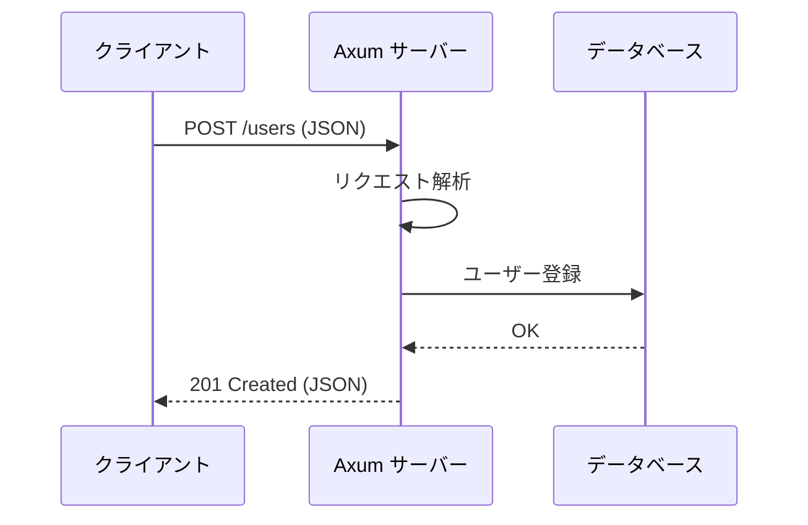

# Axum で始める Web API 開発

Axum は Tokio チーム開発による軽量で高速な Web フレームワークです。シンプルな API でありながら、強力な機能を提供します。

## 最小限の HTTP サーバー

```rust:main.rs
use axum::{routing::get, Router};
use std::net::SocketAddr;

#[tokio::main]
async fn main() {
    let app = Router::new()
        .route("/", get(hello));
    
    let addr = SocketAddr::from(([127, 0, 0, 1], 3000));
    axum::Server::bind(&addr)
        .serve(app.into_make_service())
        .await
        .unwrap();
}

async fn hello() -> &'static str {
    "Hello, Axum!"
}
```

:::message[ハンドラーは非同期関数]{info}
Axum のハンドラーは非同期関数（[[async-await]]）で実装します。`async fn` はコンパイル時に `Future` を返すようにエクスポートされます。
:::

## ルーティングと JSON

```rust:main.rs
use axum::{
    extract::Path,
    http::StatusCode,
    routing::{get, post},
    Json, Router,
};
use serde::{Deserialize, Serialize};

#[derive(Serialize, Deserialize)]
struct User {
    id: u32,
    name: String,
    email: String,
}

#[tokio::main]
async fn main() {
    let app = Router::new()
        .route("/users/:id", get(get_user))
        .route("/users", post(create_user));
    
    // ...
}

async fn get_user(Path(id): Path<u32>) -> Json<User> {
    Json(User {
        id,
        name: "Alice".to_string(),
        email: "alice@example.com".to_string(),
    })
}

async fn create_user(Json(user): Json<User>) -> (StatusCode, Json<User>) {
    (StatusCode::CREATED, Json(user))
}
```

:::message{tip}
JSON の自動シリアライズ・デシリアライズには `serde` クレートを使用します。`#[derive(Serialize, Deserialize)]` で簡単に実装できます。
:::

## リクエスト・レスポンスのフロー



## ミドルウェア

ロギングやエラーハンドリングなどの横断的な処理は、ミドルウェアで実装します：

```rust
use tower_http::trace::TraceLayer;
use tower_http::cors::CorsLayer;

let app = Router::new()
    .route("/users", get(list_users))
    .layer(TraceLayer::new_for_http())
    .layer(CorsLayer::permissive());
```

:::details[エラーハンドリング]
カスタムエラー型を実装して、統一されたエラーレスポンスを返すことができます。
:::

## パフォーマンス

Axum は非同期I/O（[[async-await]]）を活用し、多数の同時接続を効率的に処理できます。数千のコンカレント接続でも、ハードウェアのリソースを効率的に使用します。

https://github.com/tokio-rs/axum
