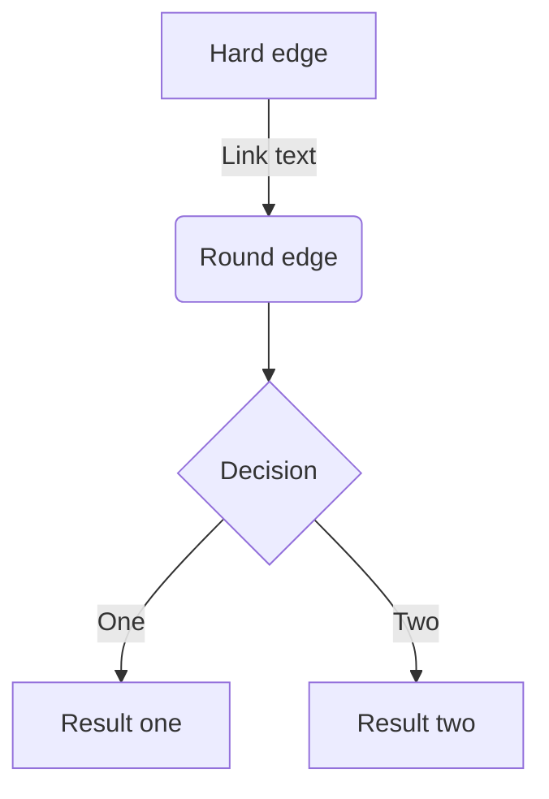

# 見出し1

## 見出し2

### 見出し3

#### 見出し4

## リスト

- Hello!
- Hola!
  - Bonjour!

## 番号付きリスト

1. First
2. Second

## チェックリスト

- [ ] 納豆
- [x] キムチ

## テキストリンク

[The Rust Programming Language](https://doc.rust-lang.org/book/)

## リンクカード

https://doc.rust-lang.org/cargo/

## 辞書リンク

本文中の[[ownership]]と[[borrowing]]のリンクです。

単独段落の辞書リンク（リンクカード化されないことの検証）:

[[ownership]]

## 画像


### 画像の幅やキャプションを指定する

:::figure[キャプションテキスト]{width=480}

:::

キャプションを省略する（width指定のみ）:

:::figure{width=320}

:::

widthを省略する（キャプションのみ）:

:::figure[width省略のキャプション]

:::

## テーブル

| Head | Head | Head |
| ---- | ---- | ---- |
| Text | Text | Text |
| Text | Text | Text |

## コードブロック

```rust
fn main() {
    println!("Hello, world!");
}
```

### ファイル名を表示する

```rust:main.rs
fn main() {
    println!("Hello, main.rs!");
}
```

### diff のシンタックスハイライト

```rust
fn main() {
    let x = 1; // [!code --]
    let x = 2; // [!code ++]
}
```

## 引用

> 引用文
> 引用文

## 注釈

脚注の例[^1]です。参照型で複数[^2]書くこともできます。

[^1]: 脚注の内容その1
[^2]: 脚注の内容その2

## 区切り線

---

## インラインスタイル

*イタリック*と**太字**と~~打ち消し線~~、インラインで`code`を挿入する。

## インラインのコメント

<!-- TODO: コメントが出力に漏れないことを確認する -->

コメントの前後の本文。時刻 12:30 のようなコロン付き文字列は消えない（textDirective復元のcanary）。

## メッセージ

:::message
通常のメッセージ
:::

:::message{info}
infoのメッセージ
:::

:::message{tip}
tipのメッセージ
:::

:::message{question}
questionのメッセージ
:::

:::message{success}
successのメッセージ
:::

:::message{warning}
warningのメッセージ
:::

:::message{danger}
dangerのメッセージ
:::

:::message[タイトルテキスト]{info}
タイトル付きのメッセージ
:::

## アコーディオン

:::details[アコーディオンのタイトル]
折りたたまれる内容
:::

### :::の要素をネストさせる

::::details[ネスト検証のタイトル]
:::message
ネストされた要素
:::
::::

::::details[アコーディオンのネスト（外側）]
外側の内容

:::details[アコーディオンのネスト（内側）]
内側の内容
:::

外側の続き
::::

## mermaid


