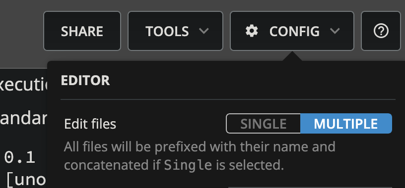
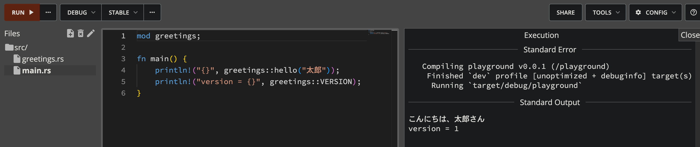
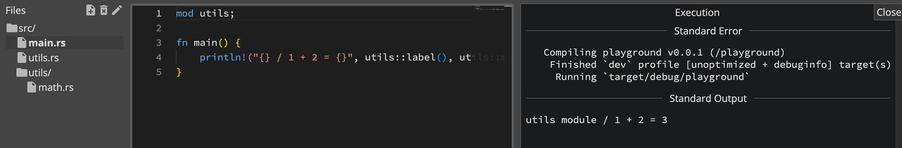
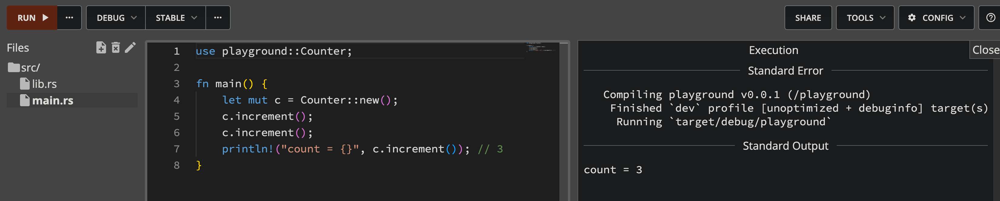
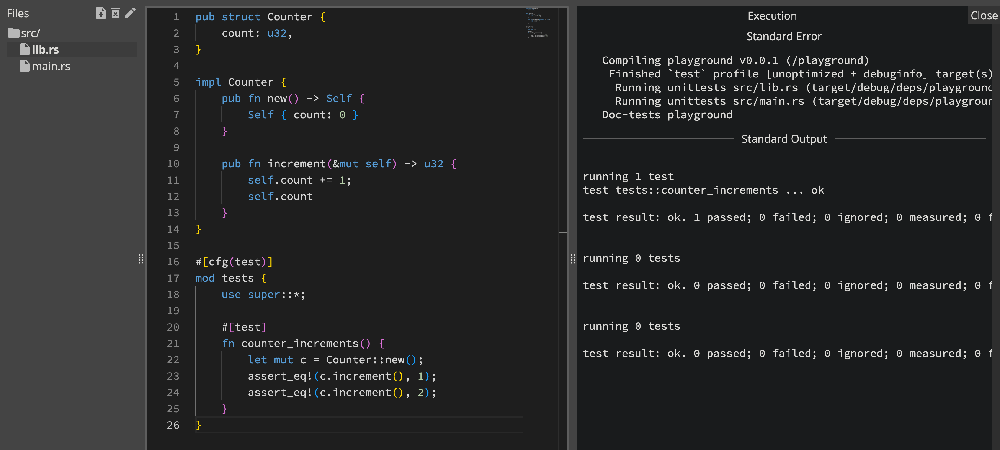
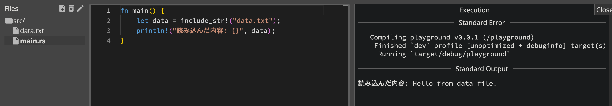

[Rust Playground](https://play.rust-lang.org/?version=stable&mode=debug&edition=2024)はRustのコードをブラウザ上で実行できる便利なサイトですが、いままでは単一ファイルの実行しかできませんでした。
それがいつのまにか複数ファイルにコードを分けて実行できるようになっていました！

マルチファイルを有効にするにはCONFIGのEdit Filesで「MULTIPLE」に変更する必要があるようです。
:::figure{width=400}

:::

:::message[待望のアップデートがサイレント実装？]{info}
マルチファイルの対応は[2019年頃から要望](https://users.rust-lang.org/t/any-plans-to-support-multiple-files-in-the-rust-playground/28384)されていました。
待望の機能リリースとなるはずですが、少なくと私が調べた限り（2026/08/04時点）では今回の対応に関する公式のアナウンスは見つかりませんでした。（準備中なのかな？）
[機能説明ページ](https://play.rust-lang.org/help)にもマルチファイルの機能説明はありませんでした。
:::

## 検証

このマルチファイルモードでなにができるのか、軽く検証していきます。

### 1. 通常のモジュール分割

Cargoプロジェクトと同じモジュール解決が効いているか検証。

```rust:src/greetings.rs
pub fn hello(name: &str) -> String {
    format!("こんにちは、{}さん", name)
}

pub const VERSION: u32 = 1;
```

```rust:src/main.rs
mod greetings;

fn main() {
    println!("{}", greetings::hello("太郎"));
    println!("version = {}", greetings::VERSION);
}
```

できる！
:::figure[実行結果]

:::

### 2. サブディレクトリ

ファイル作成時に`src/utils/math.rs`のようなパス付きの名前でディレクトリが作れるかどうか検証。

```rust:src/utils.rs
pub mod math;

pub fn label() -> &'static str {
    "utils module"
}
```

```rust:src/utils/math.rs
pub fn add(a: i32, b: i32) -> i32 {
    a + b
}
```

```rust:src/main.rs
mod utils;

fn main() {
    println!("{} / 1 + 2 = {}", utils::label(), utils::math::add(1, 2));
}
```

できる！
:::figure[実行結果]

:::

### 3. lib.rsとの共存

`src/lib.rs`を作ると、バイナリ側からライブラリクレートとして参照できるはず。Playgroundのクレート名は`playground`なので`use playground::...`で解決されるか？

```rust:src/lib.rs
pub struct Counter {
    count: u32,
}

impl Counter {
    pub fn new() -> Self {
        Self { count: 0 }
    }

    pub fn increment(&mut self) -> u32 {
        self.count += 1;
        self.count
    }
}
```

```rust:src/main.rs
use playground::Counter;

fn main() {
    let mut c = Counter::new();
    c.increment();
    c.increment();
    println!("count = {}", c.increment()); // 3
}
```

できる！
:::figure[実行結果]

:::

### 4. lib側でユニットテスト実行

lib側だけに`#[cfg(test)] mod tests`を書いてTOOLSの「Test」でユニットテストを回すことができるか検証。

```rust:src/lib.rs
pub struct Counter {
    count: u32,
}

impl Counter {
    pub fn new() -> Self {
        Self { count: 0 }
    }

    pub fn increment(&mut self) -> u32 {
        self.count += 1;
        self.count
    }
}

#[cfg(test)] // [!code ++]
mod tests { // [!code ++]
    use super::*; // [!code ++]
 // [!code ++]
    #[test] // [!code ++]
    fn counter_increments() { // [!code ++]
        let mut c = Counter::new(); // [!code ++]
        assert_eq!(c.increment(), 1); // [!code ++]
        assert_eq!(c.increment(), 2); // [!code ++]
    } // [!code ++]
} // [!code ++]
```

できる！
:::figure[実行結果]

:::

### 5. Rustコード以外のファイルを作成

`data.txt`のような`.rs`以外の拡張子を作成して読み込めるか検証。

```txt:src/data.txt
Hello from data file!
```

```rust:src/main.rs
fn main() {
    let data = include_str!("data.txt");
    println!("読み込んだ内容: {}", data);
}
```

できる！
:::figure[実行結果]

:::

## まとめ

マルチファイルモードの追加によって、「単一ファイルのスニペット実行環境」から「小規模なCargoプロジェクトをまるごと再現できる環境」に変わった感じがします。
モジュール設計や可視性（pub / pub(crate)）の挙動確認、初学者向け資料でのプロジェクト構成の説明、複数ファイルが絡むバグの再現・共有などなど、いろいろな使い道がありそうです。
