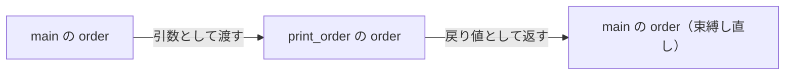

ここからは、Rust最大の特徴である**所有権**に入ります。
値がいつ破棄されるのか、なぜ代入しただけで元の変数が使えなくなるのかを、8問で身につけます。

第6章までに何度か「なぜか後から使えなくなる」という現象を保留にしてきました。ベクタを`for`式にそのまま渡すと後で使えない、`String`同士を`+`でつなぐと左辺が使えない——その答えがすべてこの章にあります。

所有権はガベージコレクション（GC）を持たないRustが、メモリの解放をコンパイル時にすべて決めるための仕組みです。他の言語にはない考え方なので最初は戸惑いますが、ルール自体は3つだけです。エラーメッセージを読みながら1問ずつ進めていけば、自然と体に入ります。

進め方は[第6章](/books/rust-learning/strings-and-vectors)までと同じです。各問題の冒頭に関連する辞書へのリンクを挙げているので、まずはリンク先で必要な知識を確認してから取り組んでください。

## 01 - スコープと値の寿命

[[ownership]]と[[variable]]に関する問題です。
次のコードはコンパイルエラー（E0425）になります。`println!`で値が出力できるように、コードの位置を1箇所だけ動かして修正してください。

```txt:期待する出力
レシート: 弁当 500円
```

<!-- rustc: expect E0425 -->
```rust:「Playgroundで開く」をクリックして修正・実行してください playground
fn main() {
    {
        let receipt = String::from("レシート: 弁当 500円");
    }

    println!("{}", receipt);
}
```

::::details[解答例と解説]
```rust playground
fn main() {
    {
        let receipt = String::from("レシート: 弁当 500円");

        println!("{}", receipt); // 波括弧の中へ移動した
    }
}
```
波括弧`{}`で囲まれた範囲を**スコープ**と呼びます。変数が使えるのは、宣言されたスコープの中だけです。`receipt`は内側の波括弧の中で宣言されているので、その外側には存在しません。エラーメッセージの`cannot find value 'receipt' in this scope`（E0425）は、まさに「このスコープに`receipt`という値は見つからない」と言っています。

スコープはこれまでも`fn main() { ... }`や`for i in 0..3 { ... }`という形でずっと使ってきました。ここで新しいのは、**スコープを抜けるときに値が破棄される**という点です。

Rustでは、すべての値がただ1つの**所有者**（owner）を持ちます。上のコードでは変数`receipt`が文字列の所有者です。そして所有者がスコープを抜けると、その値は自動的に破棄され、メモリが解放されます。

```rust playground
fn main() {
    {
        let receipt = String::from("レシート: 弁当 500円");
        println!("{}", receipt);
    } // ここで所有者receiptがスコープを抜け、文字列は自動で破棄される

    println!("スコープを抜けた後");
}
```

`String`は実行時に必要なだけメモリを確保する型でした。そのメモリはいつか誰かが解放しなければなりませんが、Rustには解放を代行するGCがありません。かわりに「所有者がスコープを抜けた地点で解放する」というルールを置くことで、**コンパイル時に解放する場所を決めてしまう**のがRustのやり方です。

:::message{tip}
[[ownership]]のルールは次の3つだけです。この章の残りはすべて、2つめのルールから生まれる話です。

1. すべての値は「所有者」を持つ
2. 所有者は常にただ1つ
3. 所有者がスコープを抜けると、値は破棄される
:::
::::

## 02 - ムーブ

[[move]]と[[ownership]]に関する問題です。
次のコードはコンパイルエラー（E0382）になります。エラーメッセージを読み、`println!`が使う変数を変えて修正してください。

```txt:期待する出力
注文内容: コーヒー ×2
```

<!-- rustc: expect E0382 -->
```rust:「Playgroundで開く」をクリックして修正・実行してください playground
fn main() {
    let order = String::from("コーヒー ×2");
    let confirmed = order;

    println!("注文内容: {}", order);
}
```

::::details[解答例と解説]
```rust playground
fn main() {
    let order = String::from("コーヒー ×2");
    let confirmed = order; // 所有権がorderからconfirmedへ移動した

    println!("注文内容: {}", confirmed);
}
```
`let confirmed = order;`は、一見すると値をコピーしているように見えます。しかし所有者は常にただ1つでなければならないため、`order`と`confirmed`が同じ文字列を同時に所有することはできません。そこでRustは**所有権を`order`から`confirmed`へ移動させ、移動元の`order`を使えない状態にします**。この移動を[[move]]（move）と呼びます。

エラーメッセージも`borrow of moved value: 'order'`（E0382）と、「ムーブ済みの値を使おうとしている」と教えてくれます。

ムーブは特別な操作を書かなくても、値の受け渡しのたびに自動で起こります。

| 場面 | 例 | 移動先 |
| --- | --- | --- |
| 変数への代入 | `let b = a;` | `b` |
| 関数の引数への受け渡し | `f(a)` | 関数の引数 |
| 関数からの戻り値 | `let b = f();` | `b` |

なぜこんな仕組みになっているかというと、問題01の「所有者がスコープを抜けたら解放する」というルールと組み合わせるためです。もし`order`と`confirmed`の両方が同じ文字列を所有できてしまうと、スコープの終わりで同じメモリを2回解放してしまいます。移動元を無効にしておけば、解放されるのは1回だけだと保証できます。

:::message{tip}
ムーブといっても、文字列の中身がメモリ上でどこかへ引っ越すわけではありません。実際に移動するのは「その文字列がどこにあるか」を示す管理情報だけで、文字列本体はその場に留まります。コピーのコストは気にしなくて構いません。
:::
::::

## 03 - Copy型はムーブしない

[[move]]と[[integer-type]]に関する問題です。
整数を別の変数に代入し、代入元と代入先の**両方**を出力してください。問題02の`String`と結果を見比べてみてください。

```txt:期待する出力
元の値: 150
コピー先: 150
```

<!-- rustc: expect E0425 -->
```rust:「Playgroundで開く」をクリックして修正・実行してください playground
fn main() {
    let price = 150;

    // priceの値をcopiedに代入せよ

    println!("元の値: {}", price);
    println!("コピー先: {}", copied);
}
```

::::details[解答例と解説]
```rust playground
fn main() {
    let price = 150;

    // priceの値をcopiedに代入せよ
    let copied = price;

    println!("元の値: {}", price); // ムーブしていないのでpriceも使える
    println!("コピー先: {}", copied);
}
```
問題02とまったく同じ`let 変数 = 変数;`という書き方なのに、今回は代入元の`price`もそのまま使えます。整数のような型ではムーブが起きず、**値そのものが複製される**からです。

このような型を`Copy`型と呼びます。これまで学んだ型では次のように分かれます。

| ムーブする型 | `Copy`型（ムーブしない） |
| --- | --- |
| `String`・`Vec<T>` | 整数型・浮動小数点型・`bool`・`char` |
| | `&str`（文字列スライス）・上記だけからなるタプル |

見分け方の目安は「**後始末が必要かどうか**」です。整数は決まった大きさの箱に値が収まっているだけなので、まるごと複製しても誰も困りませんし、破棄するときも特別な後始末は要りません。一方`String`や`Vec<T>`は実行時に確保したメモリを解放する責任を負っているため、所有者を1つに保つ必要があります。

第5章で整数の配列を`for`式にそのまま渡しても後から使えたのに、第6章でベクタでは`&`が必要だったのは、この違いによるものです。

:::message{tip}
`Copy`型でも複製されるのは値そのものだけで、コストは無視できるほど小さいものに限られています。「軽いから勝手にコピーしてよい型」とRustが認めたものが`Copy`型だと考えてください。自作の型を`Copy`型にすることもできますが、それは構造体を学んでからの話になります。
:::
::::

## 04 - 関数に渡すとムーブする

[[move]]・[[function]]・[[ownership]]に関する問題です。
次のコードはコンパイルエラー（E0382）になります。**2行の順番を入れ替えるだけ**で修正できます。どちらを先に書けばよいか考えてください。

```txt:期待する出力
控え: コーヒー ×2
注文内容: コーヒー ×2
```

<!-- rustc: expect E0382 -->
```rust:「Playgroundで開く」をクリックして修正・実行してください playground
fn print_order(order: String) {
    println!("注文内容: {}", order);
}

fn main() {
    let order = String::from("コーヒー ×2");

    print_order(order);

    println!("控え: {}", order);
}
```

::::details[解答例と解説]
```rust playground
fn print_order(order: String) {
    println!("注文内容: {}", order);
}

fn main() {
    let order = String::from("コーヒー ×2");

    println!("控え: {}", order); // ムーブする前に使う

    print_order(order); // ここで所有権が関数へ移動する
}
```
関数に値を渡すときにも、変数への代入とまったく同じようにムーブが起きます。`print_order(order)`と書いた瞬間に所有権は関数の引数`order`へ移り、呼び出し元の`order`は使えなくなります。そして関数を抜けるときに引数がスコープを抜けるので、文字列はそこで破棄されます。

つまりこのコードは「注文内容を渡したら、その注文票ごと持っていかれて手元には何も残らない」という状態です。修正版のように**ムーブより前であれば元の変数は問題なく使えます**が、これでは「渡した後にもう一度使う」ことはできません。

実際のプログラムでは「関数に値を見せたいだけで、渡してしまいたいわけではない」ほうが圧倒的に多くなります。その解決策が次の3つです。

| 方法 | 扱う問題 |
| --- | --- |
| 関数が戻り値で所有権を返す | 問題05 |
| 複製を作って渡す | 問題06 |
| 所有権を渡さずに「貸す」 | 第8章 |

:::message{tip}
エラーメッセージには
```shell
note: consider changing this parameter type in function 'print_order' to borrow instead if owning the value isn't necessary
```
というヒントが出ています。これは「所有する必要がないなら借用するように変えては」という意味で、第8章で扱う本命の解決策です。コンパイラのメッセージは長いですが、`help`や`note`の行に修正方法が書かれていることが多いので、読む習慣を付けておくと役に立ちます。
:::
::::

## 05 - 戻り値で所有権を返す

[[move]]と[[function]]に関する問題です。
`print_order`は受け取った値を戻り値として返すようになっています。呼び出した後も`order`を使い続けられるように、呼び出しの1行を書いてください。

```txt:期待する出力
注文内容: コーヒー ×2
控え: コーヒー ×2
```

```rust:「Playgroundで開く」をクリックして修正・実行してください playground
fn print_order(order: String) -> String {
    println!("注文内容: {}", order);
    order
}

fn main() {
    let order = String::from("コーヒー ×2");

    // print_orderにorderを渡し、返ってきた値をorderに束縛し直せ

    println!("控え: {}", order);
}
```

::::details[解答例と解説]
```rust playground
fn print_order(order: String) -> String {
    println!("注文内容: {}", order);
    order // 末尾の式なので、受け取った所有権をそのまま返す
}

fn main() {
    let order = String::from("コーヒー ×2");

    // print_orderにorderを渡し、返ってきた値をorderに束縛し直せ
    let order = print_order(order);

    println!("控え: {}", order);
}
```
戻り値でもムーブは起きます。関数の中で`order`という末尾の式を書くと、引数として受け取った所有権が呼び出し元へ返ります。呼び出し元はそれを`let order = ...`で受け取り直すことで、また使えるようになります。

同じ名前`order`で束縛し直しているのは、第1章で学んだ[[shadowing]]です。もちろん`let returned = print_order(order);`のように別名でも構いません。

所有権の動きを追うと、次のように一周して戻ってきています。



ただしこの書き方は、値を1つ受け渡すたびに戻り値の面倒を見なければならず、関数が複数の引数を取るとすぐに煩雑になります。第8章の参照を学べば、こうした受け渡しはほとんど不要になります。

:::message{tip}
関数が値を返すのは「返したい結果があるから」というのが本来の姿で、「所有権を返すためだけに引数をそのまま返す」書き方は実際のRustコードではあまり見かけません。ここでは所有権が関数を通り抜けて戻ってくる様子を確認するための練習だと考えてください。
:::
::::

## 06 - クローンで複製する

[[clone]]と[[move]]に関する問題です。
問題04と同じコードです。今度は**順番を変えずに**、`print_order`へ渡す値に手を加えて修正してください。

```txt:期待する出力
注文内容: コーヒー ×2
控え: コーヒー ×2
```

<!-- rustc: expect E0382 -->
```rust:「Playgroundで開く」をクリックして修正・実行してください playground
fn print_order(order: String) {
    println!("注文内容: {}", order);
}

fn main() {
    let order = String::from("コーヒー ×2");

    print_order(order);

    println!("控え: {}", order);
}
```

::::details[解答例と解説]
```rust playground
fn print_order(order: String) {
    println!("注文内容: {}", order);
}

fn main() {
    let order = String::from("コーヒー ×2");

    print_order(order.clone()); // 複製を作って渡す

    println!("控え: {}", order); // 原本の所有権は残っている
}
```
`.clone()`は、値の**独立した複製**を作るメソッドです。関数へムーブしていくのは複製のほうなので、原本を持つ`order`はそのまま使い続けられます。

ムーブが「注文票を渡してしまう」ことだとすれば、クローンは「コピーを取って渡す」ことにあたります。

`Copy`型との違いは、**明示的に書くかどうか**です。

| | `Copy` | `Clone`（`.clone()`） |
| --- | --- | --- |
| 起き方 | 代入や受け渡しで自動的に | `.clone()`と自分で書く |
| コスト | 無視できるほど小さい | 型による（大きくなりうる） |
| 対象の型 | 整数型など | `String`・`Vec<T>`など |

`String`のクローンでは、文字列データそのものをまるごと複製します。長い文字列や要素の多いベクタでは、それなりの時間とメモリを使う操作です。

:::message{warning}
コンパイルエラーが出るたびに`.clone()`を付けて回るのは、初学者がやりがちな回避策です。動きはしますが、本来必要のない複製を作るぶん無駄があります。「読むだけ」「一時的に使うだけ」なら、次の第8章で学ぶ**借用**のほうが適切です。クローンは、原本とは別に独立した値が本当に必要なときに使ってください。
:::
::::

## 07 - クローンは独立した複製

[[clone]]と[[string]]に関する問題です。
文字列をクローンし、複製のほうだけに追記してください。原本が影響を受けないことを確認します。

```txt:期待する出力
原本: 買い物メモ
複製: 買い物メモ / 牛乳
```

<!-- rustc: expect E0425 -->
```rust:「Playgroundで開く」をクリックして修正・実行してください playground
fn main() {
    let original = String::from("買い物メモ");

    // originalをクローンしてcopyに束縛せよ

    copy.push_str(" / 牛乳");

    println!("原本: {}", original);
    println!("複製: {}", copy);
}
```

::::details[解答例と解説]
```rust playground
fn main() {
    let original = String::from("買い物メモ");

    // originalをクローンしてcopyに束縛せよ
    let mut copy = original.clone();

    copy.push_str(" / 牛乳");

    println!("原本: {}", original);
    println!("複製: {}", copy);
}
```
`String`のクローンで作られる2つの値は**完全に独立**しています。それぞれが自分専用のメモリに文字列を持っているので、片方に追記しても、もう片方はまったく影響を受けません。

`mut`が必要なのは`copy`だけです。`original`は最後まで読むだけなので`mut`は要りません。第1章で学んだ「変数はデフォルトで不変」というルールは、クローンした値にもそのまま当てはまります。

これは当たり前のことのようですが、他の多くの言語では代入しただけでは中身が共有され、片方を変更するともう片方も変わってしまう（参照の共有）というつまずきがよく起こります。Rustでは`.clone()`と書いてあれば独立した複製、書いていなければムーブか`Copy`と、コードを見ただけで区別できます。

:::message{tip}
`.clone()`が常に完全な複製を作るとは限りません。何を「複製」とするかは型ごとに決められていて、たとえば複数の場所でデータを共有するための型では、`.clone()`してもデータ本体は複製されません。とはいえ`String`や`Vec<T>`など普段使う型では、ここで見たとおり独立した複製が作られると考えて構いません。
:::
::::

## 08 - 応用: 所有権の行方を追う

この章の総復習として、[[move]]・[[clone]]・[[ownership]]・[[function]]を組み合わせた問題です。
2箇所の空欄を埋めて、期待する出力にしてください。`backup`には**追記する前の内容**を残しておく必要があります。

```txt:期待する出力
コーヒー ×2!!
原本: コーヒー ×2
控え: コーヒー
個数: 2 / 2
```

<!-- rustc: expect E0425 -->
```rust:「Playgroundで開く」をクリックして修正・実行してください playground
fn shout(text: String) -> String {
    println!("{}!!", text);
    text
}

fn main() {
    let count = 2;
    let doubled = count;

    let mut order = String::from("コーヒー");

    // 現在のorderの内容を控えとしてbackupに残せ

    order.push_str(" ×2");

    // shoutにorderを渡し、呼び出した後もorderを使い続けられるようにせよ

    println!("原本: {}", order);
    println!("控え: {}", backup);
    println!("個数: {} / {}", count, doubled);
}
```

::::details[解答例と解説]
```rust playground
fn shout(text: String) -> String {
    println!("{}!!", text);
    text
}

fn main() {
    let count = 2;
    let doubled = count; // 整数はCopy型なのでムーブしない

    let mut order = String::from("コーヒー");

    // 現在のorderの内容を控えとしてbackupに残せ
    let backup = order.clone();

    order.push_str(" ×2");

    // shoutにorderを渡し、呼び出した後もorderを使い続けられるようにせよ
    let order = shout(order);

    println!("原本: {}", order);
    println!("控え: {}", backup);
    println!("個数: {} / {}", count, doubled);
}
```
この章で扱った3つの振る舞いが1つのコードに同居しています。それぞれ確認していきましょう。

**`let doubled = count;`（`Copy`）**
`count`は整数なのでムーブは起きません。何も書かなくても`count`と`doubled`の両方が最後まで使えます。

**`let backup = order.clone();`（クローン）**
`let backup = &order;`のような書き方では「追記する前の内容」は残せません。**参照は値そのものを持たないので、原本が書き換われば見える内容も変わってしまう**からです（正確にはこの書き方は第8章で学ぶ借用規則にも触れてコンパイルが通りません）。追記前の姿を独立した値として保存したいので、ここはクローンが正解です。

**`let order = shout(order);`（ムーブと戻り値）**
`shout`は`String`を引数に取るので、渡した時点で所有権が移ります。戻り値で返ってくる所有権を`let order = ...`で受け取り直すことで、その後の`println!`でも使えるようになります。ここを`shout(order);`とだけ書くと、次の行でE0382になります。

:::message{tip}
所有権で行き詰まったときは、変数ごとに「今この値を所有しているのは誰か」を追いかけてみてください。ムーブした行に印を付けていくと、エラーになっている行が「すでに手放した後」であることがはっきり見えてきます。
:::

これで第7章は終わりです。所有権・ムーブ・クローンという、Rustのメモリ管理の骨格が一通りそろいました。

ただし現時点の道具では、関数に値を見せるたびに「戻り値で返してもらう」か「複製を作る」かのどちらかを選ばなければならず、どう考えても不便です。実際のRustコードではそのどちらでもない第3の方法——**所有権を渡さずに値を貸す**——が主役になります。次の章のテーマである**参照と借用**です。
::::
