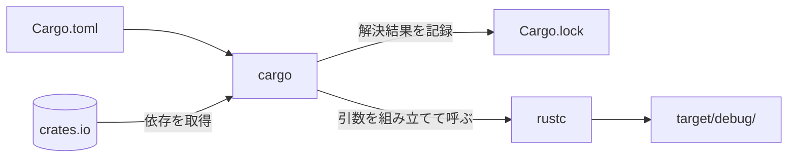

Cargoは、Rustの公式パッケージマネージャです。[[package]]の依存関係を宣言できるようにし、いつでも同じ結果になるビルドを保証します[^1]。さらに、依存を取得したうえで正しい引数を組み立てて`rustc`を呼び出すところまで引き受けるため、ビルドシステムとしての役割も兼ねています[^1]。

`rustc`にソースファイルを渡すだけでもコンパイルはできます。しかしコンパイラフラグや外部の依存を指定し始めるとコマンドは一気に複雑になり、依存のそのまた依存まで含めて正しいバージョンを手で揃え続けるのは骨が折れるうえに間違いも起きます[^1]。Cargoはこれを`Cargo.toml`への宣言に置き換え、以降は`cargo`のサブコマンド1つで済ませられるようにします。

```text
$ cargo new shopping        # パッケージのひな形を作る
    Creating binary (application) `shopping` package
$ cd shopping
$ cargo add regex           # 依存を Cargo.toml に追記する
    Updating crates.io index
      Adding regex v1.13.1 to dependencies
     Locking 5 packages to latest Rust 1.93.0 compatible versions
$ cargo run                 # 依存ごとビルドして実行する
   Compiling memchr v2.8.3
   Compiling regex-syntax v0.8.11
   Compiling aho-corasick v1.1.5
   Compiling regex-automata v0.4.18
   Compiling regex v1.13.1
   Compiling shopping v0.1.0 (/path/to/shopping)
    Finished `dev` profile [unoptimized + debuginfo] target(s) in 2.34s
     Running `target/debug/shopping`
Hello, world!
```

指定した依存は`regex`ひとつですが、解決された[[package]]は5つあります。`regex`が内部で使っているパッケージまでCargoが辿って取得し、それぞれの[[crate]]をビルドしているためで、`Locking 5 packages`はその解決結果です（Rust 1.93時点の実行結果。`cargo add`が出力する情報行の一部は省略しています）。

## rustcとの関係

コンパイルそのものを行うのはあくまで`rustc`で、Cargoはその司令塔にあたります。`rustc main.rs`と実行すればCargoなしでも実行ファイルは作れますが、ファイルが増え、外部の依存が絡み、同じビルドを再現したくなった時点でCargoが要るようになります。



## 代表的なコマンド

よく使うサブコマンドは次のとおりです[^2]。

| コマンド         | 何をするか                                                     |
| ---------------- | -------------------------------------------------------------- |
| `cargo new 名前` | パッケージのひな形（`Cargo.toml`と`src/main.rs`）を作る         |
| `cargo build`    | 依存ごとビルドし、実行ファイルを`target/debug/`に置く           |
| `cargo run`      | ビルドしてそのまま実行する                                     |
| `cargo check`    | コード生成を省いてエラーの有無だけを調べる。`cargo build`より速い |
| `cargo test`     | パッケージ内のテストをコンパイルして実行する                   |
| `cargo add 名前` | 依存を`Cargo.toml`の`[dependencies]`へ追記する                 |

## Cargo.tomlとCargo.lockの役割分担

2つのメタデータファイルは、`Cargo.toml`が人の書く「要望」、`Cargo.lock`がCargoの書き出す「結果」という関係にあります[^4]。

|              | `Cargo.toml`（マニフェスト）                  | `Cargo.lock`（ロックファイル）                 |
| ------------ | --------------------------------------------- | ---------------------------------------------- |
| 書く人       | 自分で書く                                    | Cargoが生成・更新する（手で編集しない）        |
| 書かれる内容 | 依存を大まかな範囲で指定する（`regex = "1"`） | 実際に使われた版とチェックサムを正確に記録する |
| 目的         | 何が必要かを宣言する                          | ビルドを再現できるようにする                   |

`Cargo.toml`を書き換えない限り、Cargoは`Cargo.lock`に記録された版をそのまま使います。そのため時期や環境が違っても同じ依存でビルドできます[^5]。依存を足したり`cargo update`を実行したりすれば、その部分は解決し直されて`Cargo.lock`が更新されます[^4]。

## crates.ioとの関係

crates.ioはRustコミュニティのパッケージレジストリで、Cargoの**既定のレジストリ**です[^6]。`[dependencies]`に名前とバージョンを書いて[[external-package]]を宣言すると、Cargoは既定でここから該当パッケージを取得します。`cargo add`が最初に「Updating crates.io index」と表示するのは、どのバージョンが存在するかをこのレジストリに問い合わせているためです。

なお[[standard-library]]はツールチェーンの一部（rustupでは`rust-std`コンポーネント）として配布されるため、crates.ioからの取得対象にはなりません[^7]。

## 補足

:::details[Cargoが引き受けている4つのこと]
The Cargo Bookは、Cargoの仕事を次の4つとして挙げています[^1]。

1. パッケージの情報を持つ2つのメタデータファイルを導入する
2. パッケージの依存を取得してビルドする
3. 正しい引数を組み立てて`rustc`（または別のビルドツール）を呼び出す
4. パッケージを扱いやすくするための規約を導入する

1番目の2つのファイルが`Cargo.toml`と`Cargo.lock`です[^4]。4番目の規約は、`src/main.rs`なら実行ファイル・`src/lib.rs`ならライブラリといった、[[crate]]の項で扱うファイル配置のルールを指します。
:::

:::details[cargo checkが速い理由]
`cargo check`は、コンパイルのうち最後のコード生成（機械語の出力）を行いません。そのぶん`cargo build`より速く終わり、型エラーや[[borrow-checker]]が出すエラーを見つける用途に向いています[^3]。

ただし、コード生成の段階でしか出ない診断やエラーは`cargo check`では報告されません[^3]。最終的な確認は`cargo build`や`cargo test`で行う必要があります。
:::

:::details[Cargo.lockをバージョン管理に入れるか]
`cargo new`は既定で`Cargo.lock`を追跡する設定にしますが、実際に入れるかどうかはパッケージの事情によります[^5]。バージョン管理に入れておくと、`git bisect`で不具合の原因をたどるときや、CIの失敗が新しいコミットのせいだと切り分けたいときに役立ちます[^5]。

一方で`Cargo.lock`は、自分のパッケージを**使う側**には影響しません。利用者の依存解決に効くのは`Cargo.toml`だけです[^5]。例外は`cargo install --locked`で、このときだけはロックファイルに記録された版が使われます[^5]。

なお`cargo new`が生成する`.gitignore`はビルド成果物の`/target`だけを無視する内容なので、`Cargo.lock`は既定でコミット対象に含まれます（Rust 1.93時点）[^2]。
:::

[^1]: [Why Cargo Exists — The Cargo Book](https://doc.rust-lang.org/cargo/guide/why-cargo-exists.html)

[^2]: [Creating a New Package — The Cargo Book](https://doc.rust-lang.org/cargo/guide/creating-a-new-project.html)、[Commands — The Cargo Book](https://doc.rust-lang.org/cargo/commands/index.html)、[cargo new — The Cargo Book](https://doc.rust-lang.org/cargo/commands/cargo-new.html)

[^3]: [cargo check — The Cargo Book](https://doc.rust-lang.org/cargo/commands/cargo-check.html)

[^4]: [Cargo.toml vs Cargo.lock — The Cargo Book](https://doc.rust-lang.org/cargo/guide/cargo-toml-vs-cargo-lock.html)

[^5]: [FAQ（Why have Cargo.lock in version control?） — The Cargo Book](https://doc.rust-lang.org/cargo/faq.html#why-have-cargolock-in-version-control)

[^6]: [Registries — The Cargo Book](https://doc.rust-lang.org/cargo/reference/registries.html)

[^7]: [Components — The rustup book](https://rust-lang.github.io/rustup/concepts/components.html)
