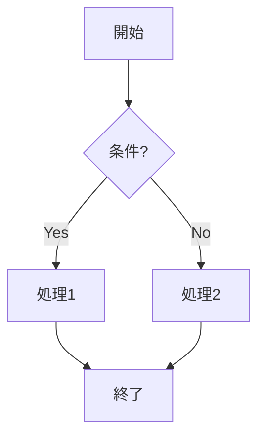
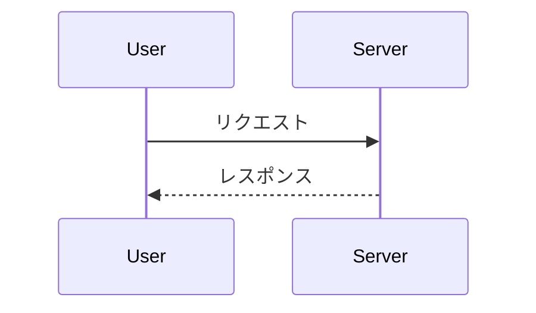

# Sätteri技術検証 結果

> [!warning] 凍結済みアーカイブ
> 本検証は2026-07-08にクローズ済み。本書は歴史的記録であり**更新しない**。
> 本番実装の参照先は `../../markdown-pipeline/README.md`（本書の生きた知識は同ディレクトリ配下の機能別文書へ抽出済み）。

## 検証環境

- 検証日: 2026-07-07（A〜C, B） / 2026-07-08（F, E, D）
- バージョン一覧
  - astro: 7.0.6
  - @astrojs/markdown-satteri: 0.3.3
  - satteri: 0.9.4
  - @shikijs/transformers: 4.3.1（F検証で導入）
  - mermaid-isomorphic: 3.1.0（E検証で導入）
  - mermaid: 11.16.0（mermaid-isomorphic の依存）
  - playwright: 1.61.1（E検証で導入）
  - Chromium: playwright chromium-headless-shell v1228（`npx playwright install chromium`）
- `astro.config.mjs` は `markdown.processor` を明示指定しない状態（デフォルトのSätteriが使用される）
- 素のMarkdownページ（見出し・強調・リスト・引用・コードブロック・リンク・GFMテーブル）を含む`src/pages/test.md`で`astro build`が正常終了（exit 0）し、`dist/test/index.html`に想定どおりのHTMLが出力されることを確認済み

## 判定サマリ

| グループ | 判定 | 一言メモ |
| --- | --- | --- |
| A. プラグインAPI基礎 | PASS(条件付き) | ノード操作・async・状態管理はすべて仕様どおり動作。ただしビルドエラー化は`ctx.report(error)`では不可（Astroが診断を読まない）→ **visitor内throwで実現**（ファイル名・位置も表示可能） |
| B. wikilink | PASS(条件付き) | 検出・分割・属性付与・辞書一覧注入・ビルドエラー化・title表示のすべてが仕様どおり動作。ただし**新規生成ノードへの属性付与は`setProperty`ではなく`data`をノードリテラルへ直接埋め込む方式が必須**（A-2で確認した`setProperty`はツリー由来ノード限定と判明） |
| C. `:::`ディレクティブ | PASS(条件付き) | 3記法とも変換可能（`data.hName`方式）。ただし①`:::message alert`→`:::message{alert}`、②`:::details タイトル`→`:::details[タイトル]`へ**記法変更が必須**（旧記法は引数が黙って消える）。③`directive: true`で本文中の`x:y`が誤って消えるため**textDirective復元プラグインが必須** |
| D. リンクカード | PASS(条件付き) | 検出（単独ベアURLのみ）・async OGP取得・ビルド跨ぎキャッシュ・失敗フォールバックすべて動作。ただし①**カードHTMLは`{ rawHtml }`で埋め込むと mdast 段階で markdown 再パースされる**ため、内部のURLテキストが GFM autolink-literal で二重リンク化する。→ **カードを block 要素（`<div>`）で開始**すれば HTML ブロックとして verbatim 出力される（inline の`<a>`開始はNG）。②検出は「段落の唯一の子が`link`かつ`link`の唯一のtext子の値===`link.url`」で通常リンク・文中URLと区別 |
| E. mermaid | PASS(条件付き) | ビルド時SVG化・dual theme・raw埋め込みは仕様どおり動作。ただし①**id一意化は mermaid-isomorphic の `prefix` だけでは不十分**（svgルート/マーカーidしか名前空間化されず、内部id `L_A_B_0`/`actor0` 等が light/dark で衝突）→ **SVG文字列の全idを自前で名前空間化する後処理が必須**。②WSL2/CIでは `playwright install-deps`（sudo, 一度きり）でChromiumのOS依存を入れる必要あり |
| F. Shiki連携 | PASS | diff・dual theme・ファイル名の3要件を**記法変更なし**で実現。Shiki設定は`satteri()`ではなく`markdown.shikiConfig`直下に置く。ファイル名記法はmdast前処理プラグイン1つが必要（`replaceNode`で生成したcodeノードもハイライト可） |

### 全体判定: **Sätteri続行（`unified()`への切替は不要）**

- 6グループすべてでFAILなし（PASS×1 / PASS(条件付き)×5）。計画書の中断基準（ノード操作が実用にならない / ビルドを失敗させる手段がない）にも非該当（A-2でノード操作一式、A-4でthrow方式のビルドエラー化を実証済み）
- PASS(条件付き)の条件はいずれも**対応方法を実証済み**: ①ビルドエラー化はthrow方式（A）、②新規ノードへの属性は`data`リテラル埋め込み（B）、③ディレクティブ記法2点の変更+textDirective復元プラグイン（C）、④カードHTMLはblock要素開始の`rawHtml`（D）、⑤SVG全idの名前空間化後処理（E）。本番実装の雛形コードも各節に揃っている
- 本判定をもって検証をクローズする（クローズ日: 2026-07-08。CLAUDE.md反映事項は適用済み、`sandbox/`は削除済み）

## A. プラグインAPI基礎

### 判定: PASS(条件付き)

条件: ビルドエラー化の手段を`ctx.report({ severity: "error" })`から**visitor内での`throw`**に変更する（詳細は「ハマった点」参照）。それ以外（A-1/A-2/A-3/A-5/A-6）は事前調査どおりの挙動で、調整不要。

| # | 結果 |
| --- | --- |
| A-1 | ✅ mdast/hast両方のvisitorが購読どおり呼ばれる（走査はpre-order: 親→子） |
| A-2 | ✅ `setProperty` / `replaceNode` / `removeNode` / `insertBefore` / `insertAfter` / `wrapNode` / visitor戻り値による置換 / `{ rawHtml }`挿入、すべて期待どおり |
| A-3 | ✅ asyncビジター（`await sleep(500)` + 外部`fetch`）をビルドが待ち、結果がHTMLに反映される |
| A-4 | ⚠️ `ctx.report(error)`ではビルドが**失敗しない**（exit 0、メッセージも出力されない）。**visitor内`throw`でexit 1**になり、エラーメッセージも表示される |
| A-5 | ✅ ファクトリ形式は文書ごとにクロージャがリセットされる。定義オブジェクト直渡しはモジュールレベル状態が全文書で共有される |
| A-6 | ✅ 自プラグインの生成ノードは再走査されない（無限ループしない）。**後段の別プラグインからは生成ノードが見える**。削除済みサブツリー内ノードへの変換はwarning付きで破棄され、ビルドは成功する |

### 動作確認済みコード

#### astro.config.mjs への登録方法

```js
// @ts-check
import { defineConfig } from 'astro/config';
import { satteri } from '@astrojs/markdown-satteri';
import { myMdastPlugin, myHastPlugin } from './plugins/my-plugin.mjs';

export default defineConfig({
  markdown: {
    processor: satteri({
      mdastPlugins: [myMdastPlugin], // 定義オブジェクト or ファクトリ関数
      hastPlugins: [myHastPlugin],
    }),
  },
});
```

#### A-2: ノード操作（`plugins/a2-mutation.mjs`）

```js
import { defineMdastPlugin } from 'satteri';

const text = (value) => ({ type: 'text', value });
const paragraph = (value) => ({ type: 'paragraph', children: [text(value)] });

export const a2Mutation = defineMdastPlugin({
  name: 'a2-mutation',
  heading(node, ctx) {
    // setProperty: h2 -> h3
    if (node.depth === 2) {
      ctx.setProperty(node, 'depth', 3);
    }
  },
  paragraph(node, ctx) {
    const content = ctx.textContent(node);
    if (content.startsWith('MARKER_REPLACE')) {
      ctx.replaceNode(node, paragraph('REPLACED_BY_CTX'));
    } else if (content.startsWith('MARKER_RETURN')) {
      return paragraph('REPLACED_BY_RETURN'); // 戻り値でも置換できる（replaceNodeと同じ結果）
    } else if (content.startsWith('MARKER_REMOVE')) {
      ctx.removeNode(node);
    } else if (content.startsWith('MARKER_INSERT')) {
      ctx.insertBefore(node, paragraph('INSERTED_BEFORE'));
      ctx.insertAfter(node, paragraph('INSERTED_AFTER'));
    } else if (content.startsWith('MARKER_WRAP')) {
      ctx.wrapNode(node, { type: 'blockquote', children: [] });
    } else if (content.startsWith('MARKER_RAWHTML')) {
      ctx.replaceNode(node, { rawHtml: '<div class="raw-html-test"><svg width="10" height="10"><rect width="10" height="10"/></svg></div>' });
    }
  },
});
```

入力md（`a2.md`）と出力HTML（`dist/a2/index.html`）:

```markdown
## setPropertyで見出しレベル変更

MARKER_REPLACE この段落はreplaceNodeで置き換わる

MARKER_RETURN この段落はvisitor戻り値で置き換わる

MARKER_REMOVE この段落は削除される

MARKER_INSERT この段落の前後にノードが挿入される

MARKER_WRAP この段落はblockquoteでラップされる

MARKER_RAWHTML この段落はrawHtmlに置き換わる
```

```html
<h3 id="setpropertyで見出しレベル変更">setPropertyで見出しレベル変更</h3>
<p>REPLACED_BY_CTX</p>
<p>REPLACED_BY_RETURN</p>
<p>INSERTED_BEFORE</p>
<p>MARKER_INSERT この段落の前後にノードが挿入される</p>
<p>INSERTED_AFTER</p>
<blockquote>
<p>MARKER_WRAP この段落はblockquoteでラップされる</p>
</blockquote>
<div class="raw-html-test"><svg width="10" height="10"><rect width="10" height="10"/></svg></div>
```

`{ rawHtml }`は**エスケープされずそのまま出力される**（SVG埋め込み＝E-4の成立見込みを先行確認済み）。`MARKER_REMOVE`の段落は出力に存在しない。

#### A-3: asyncビジター（`plugins/a3-async.mjs`）

```js
import { setTimeout as sleep } from 'node:timers/promises';
import { defineMdastPlugin } from 'satteri';

export const a3Async = defineMdastPlugin({
  name: 'a3-async',
  async text(node, ctx) {
    if (node.value.includes('ASYNC_FETCH_TARGET')) {
      await sleep(500);
      const res = await fetch('https://example.com/');
      const html = await res.text();
      const title = html.match(/<title>(.*?)<\/title>/)?.[1] ?? 'NO_TITLE';
      ctx.replaceNode(node, {
        type: 'text',
        value: `FETCHED_TITLE=[${title}] STATUS=${res.status}`,
      });
    }
  },
});
```

出力: `<p>FETCHED_TITLE=[Example Domain] STATUS=200</p>`（ビルドexit 0。D-2/E-3の前提が成立）

#### A-4: ビルドエラー化の雛形（`plugins/a4-report.mjs`）— **B-5（wikilink検証）はこの方式を使う**

```js
import { fileURLToPath } from 'node:url';
import { defineMdastPlugin } from 'satteri';

export const a4Throw = defineMdastPlugin({
  name: 'a4-throw',
  text(node, ctx) {
    if (node.value.includes('ERROR_TRIGGER')) {
      const file = ctx.fileURL ? fileURLToPath(ctx.fileURL) : '(不明なファイル)';
      const pos = node.position
        ? `${node.position.start.line}:${node.position.start.column}`
        : '?:?';
      throw new Error(
        `A-4検証: visitor内throwによるビルド失敗テスト (${file}:${pos})`,
      );
    }
  },
});
```

`ctx.fileURL`（処理中mdのURL）と`node.position`は取得でき、メッセージに含められる。

#### A-5: ファクトリ形式（`plugins/a5-factory.mjs`）

```js
import { defineMdastPlugin } from 'satteri';

// ファクトリ形式: 文書（コンパイル）ごとに呼ばれ、クロージャがリセットされる
export const a5Factory = () => {
  let counter = 0;
  return defineMdastPlugin({
    name: 'a5-factory-counter',
    heading(node, ctx) {
      counter += 1;
      ctx.appendChild(node, { type: 'text', value: ` [F${counter}]` });
    },
  });
};

// 対比用の非ファクトリ形式: 全文書でモジュールレベルの状態が共有される
let sharedCounter = 0;
export const a5Shared = defineMdastPlugin({
  name: 'a5-shared-counter',
  heading(node, ctx) {
    sharedCounter += 1;
    ctx.appendChild(node, { type: 'text', value: ` [S${sharedCounter}]` });
  },
});
```

2ページ（各h2×2）+ 他の検証ページを同時ビルドした結果:

```html
<!-- dist/a5-one/index.html -->
<h2>一番目の見出し [F1] [S4]</h2>
<h2>二番目の見出し [F2] [S5]</h2>
<!-- dist/a5-two/index.html -->
<h2>三番目の見出し [F1] [S6]</h2>
<h2>四番目の見出し [F2] [S7]</h2>
```

ファクトリ（F）はページごとに1から、直渡し（S）は全ページ通算 → **文書ごとの状態が必要なプラグインは必ずファクトリ形式にする**。

#### A-6: 再走査・サブツリー削除（`plugins/a6-rescan.mjs`）

```js
import { defineMdastPlugin } from 'satteri';

// (1) 自プラグインが生成したノードを自分で再訪問しないか
//     生成するtextにもGENERATE_MARKERを含める → 再走査されるなら無限に増える
export const a6Generator = defineMdastPlugin({
  name: 'a6-generator',
  text(node, ctx) {
    console.log(`[A6:gen] visit text: ${JSON.stringify(node.value.slice(0, 40))}`);
    if (node.value.includes('GENERATE_MARKER')) {
      ctx.insertAfter(node, {
        type: 'text',
        value: ' <<生成ノード GENERATE_MARKER を含む>>',
      });
    }
  },
});

// (2) 後段の別プラグインが(1)の生成ノードを訪問できるか
export const a6Observer = defineMdastPlugin({
  name: 'a6-observer',
  text(node) {
    console.log(`[A6:obs] visit text: ${JSON.stringify(node.value.slice(0, 40))}`);
  },
});

// (3) 子に変換を積んだ状態で親サブツリーを削除 → warningの観察
export const a6SubtreeRemove = defineMdastPlugin({
  name: 'a6-subtree-remove',
  blockquote(node, ctx) {
    ctx.removeNode(node);
  },
  text(node, ctx) {
    if (node.value.includes('NESTED_CHILD')) {
      ctx.replaceNode(node, { type: 'text', value: '置換済みNESTED_CHILD' });
    }
  },
});
```

観測結果（入力: `GENERATE_MARKER ここから生成される` の段落 + `NESTED_CHILD`を含むblockquote）:

- `[A6:gen]`は生成ノード` <<生成ノード GENERATE_MARKER を含む>>`を**訪問しない**（無限ループなし）
- `[A6:obs]`（後段プラグイン）は生成ノードを**訪問する** → プラグインは登録順に文書全体を走査する（パイプライン式）
- blockquote削除後もその子のtext visitorは呼ばれ、`replaceNode`を積むと以下のwarningが出てビルドは成功（exit 0）:

```
satteri: plugin "a6-subtree-remove" queued 1 mdast transform on node(s) that were removed or replaced earlier in the same pass; it was dropped.
```

### 実測したノード構造

A-1の素通しロガー（入力は手順1の`test.md`: 見出し・強調・リスト・引用・rustコードブロック・リンク・GFMテーブル）で観測したvisitor呼び出し:

- **mdast**（抜粋）: `heading depth=1` → `text "見出し1"` → … → `code lang=rust meta=null` → `link url=https://example.com` → `table` / `tableRow` / `tableCell`。走査は**pre-order（親→子、文書先頭から）**
- **コードブロック（`code`）・インラインコード（`inlineCode`）の中身は`text` visitorに来ない**（それぞれ専用visitorのみ。B-2の誤変換防止の前提が成立）
- frontmatter（`---`ブロック）で`yaml` visitorは**呼ばれなかった**（Astro側で事前に除去されている模様）
- **hast**: `element` visitorは`{ filter: ['h1','pre','a',...], visit(node) {} }`形式でtagName一致のみ届く。`properties`も読める（例: `<a>`で`{"href":"https://example.com"}`）。`text` / `raw`はbare関数
- **Shikiでハイライト済みのコードブロックは、hastでは`element`ではなく`raw`ノード**として届く: `raw "<pre class=\"astro-code github-dark\" style=\"background-color:..."`（E-1でmermaid検出方法に影響する可能性 → Eで要確認）

### ハマった点と回避策

1. **`ctx.report({ severity: "error" })`でビルドが失敗しない（A-4の本命が不成立）**
   - exit 0でビルド成功し、エラーメッセージも一切出力されない（`grep -i "error\|warn"`にヒットなし）
   - 原因: `node_modules/@astrojs/markdown-satteri/dist/`および`node_modules/astro/dist/vite-plugin-markdown/`に`diagnostics`を読むコードが存在しない。satteriはdiagnosticsを収集するが、**Astro側がそれを一切参照せず黙って捨てる**
   - 回避策: **visitor内で`throw new Error(...)`する**。exit 1で失敗し、メッセージも表示される
2. **throwのエラー表示のLocationがデフォルトではsatteri内部を指す**
   - `throw new Error('...')`だけだと `Location: .../node_modules/satteri/dist/mdast/mdast-visitor.js:545:36` と表示され、どのmdが原因か分からない（スタックトレースにプラグインファイルは出る）
   - 回避策: メッセージに`(絶対パス:行:列)`形式で`fileURLToPath(ctx.fileURL)`と`node.position`を含める。この形式にしたところ、Astroのエラー表示のLocationも対象mdファイル（`.../src/pages/a4.md:7:1`）を指した

### 本番実装時の注意事項

- **ビルドエラー化はすべてthrow方式**で実装する（wikilinkのリンク切れ検証=B-5など）。メッセージには`fileURLToPath(ctx.fileURL)`と`node.position.start`を`(パス:行:列)`形式で必ず含める
- **文書ごとの状態（カウンタ、収集リスト等）を持つプラグインは必ずファクトリ形式**（`() => defineMdastPlugin({...})`）にする。定義オブジェクト直渡しだと全文書で状態が共有される（mermaidのid採番などで事故る）
- プラグインは登録順の直列パイプライン。前段プラグインが生成したノードを後段は普通に訪問できるが、**自プラグインの生成ノードは自分では再訪問されない**
- ノード削除は子のvisitor呼び出しを止めない。削除済みサブツリーへ積んだ変換はwarning付きで破棄される（ビルドは落ちない）ので、「親を消したら子は触らない」前提のロジックは書かない
- `{ rawHtml }`はエスケープなしで出力される。SVG（mermaid）やカードHTMLの挿入手段として使える
- `text` visitorは`code`/`inlineCode`の中身には呼ばれない → wikilink誤変換防止はvisitor購読モデルだけで担保される
- Shiki処理済みコードブロックはhastで`raw`ノードになる（`element` filterでは捕捉できない）
- frontmatterの`yaml` visitorはAstro経由では呼ばれない（frontmatterはAstroが処理）
- `ctx.data`（文書レベル共有バッグ）はmdast→hast間でも共有される（型定義で確認。実測はB以降で使う際に行う）

## B. wikilink

### 判定: PASS(条件付き)

条件: 新規生成する`link`ノードへの属性付与は、A-2で確認した`ctx.setProperty`ではなく**ノードリテラルに`data`を直接埋め込む方式**を使う（詳細は「ハマった点」参照）。それ以外（B-1〜B-6のロジック自体）は事前調査どおりの設計で、記法・仕様の変更は不要。

| # | 結果 |
| --- | --- |
| B-1 | ✅ `text` visitorで`[[slug]]`を正規表現検出し、前後のtextノード＋`link`ノードに分割して`ctx.insertBefore(node, pieces)` + `ctx.removeNode(node)`で置換。`<a href="/dict/ownership">`が出力される |
| B-2 | ✅ Rustコードブロック（\`\`\`rust）およびインラインコード内の`[[i32; 2]; 3]` / `[[i32; 2]]`は完全に無変換のまま出力される（A-1で確認済みの「`text` visitorはcode/inlineCode内に来ない」がそのままB-2の防止策として機能） |
| B-3 | ✅ `<a>`に`class="wikilink"`と`data-dict-link="ownership"`が付与される |
| B-4 | ✅ `astro.config.mjs`評価時に`content/dict/*.md`のfrontmatterを`js-yaml`で直接パースし、結果の配列を`bWikilink(dictIndex)`ファクトリへ注入する方式が成立（`gray-matter`は未導入・不要だった） |
| B-5 | ✅ 存在しないslugへの`[[...]]`、および**公開ページ**から`public: false`のslugへの`[[...]]`はvisitor内`throw`（A-4方式）でビルドが非0終了する。メッセージにファイル名・行:列・原因（存在しない/非公開）が正しく出る。CLAUDE.mdの非対称ルール（**非公開ページ→非公開辞書はOK**）も、`ctx.fileURL`からソースページ自身を読み直してpublicフラグを判定する**プラグイン側の分岐ロジックとして**実現・確認済み（詳細は下記コード・「ハマった点」参照）。※`src/pages/*.md`上での検証であり、コンテンツコレクション（Content Layer API）経由での`ctx.fileURL`解決は未検証（残課題参照） |
| B-6 | ✅ リンクテキストはファイル名ではなく辞書一覧から引いた`title`（例: `[[ownership]]` → `所有権`）になる |

### 動作確認済みコード

#### `plugins/dict-index.mjs`（B-4: config時点でのfrontmatter直読み）

```js
import { readFileSync, readdirSync } from 'node:fs';
import { fileURLToPath } from 'node:url';
import yaml from 'js-yaml';

export function loadDictIndex(dictDirURL) {
  const dir = fileURLToPath(dictDirURL);
  return readdirSync(dir)
    .filter((f) => f.endsWith('.md'))
    .map((f) => {
      const raw = readFileSync(`${dir}/${f}`, 'utf8');
      const m = raw.match(/^---\n([\s\S]*?)\n---/);
      const fm = m ? yaml.load(m[1]) : {};
      return {
        slug: f.replace(/\.md$/, ''),
        title: fm.title ?? f,
        public: fm.public !== false,
      };
    });
}
```

#### `plugins/b-wikilink.mjs`（B-1/B-3/B-5/B-6）

```js
// ※CLAUDE.mdの仕様は非対称（非公開ページ→非公開辞書はOK）。
//   ctxは処理中ドキュメント自身のfrontmatterを公開しないため（A-1: yaml visitorは呼ばれない）、
//   ctx.fileURLから自分でソースファイルを読み直してpublicフラグを判定する
import { readFileSync } from 'node:fs';
import { fileURLToPath } from 'node:url';
import { defineMdastPlugin } from 'satteri';
import yaml from 'js-yaml';

function isSourcePagePublic(ctx) {
  if (!ctx.fileURL) return true; // fileURL不明時は判定できないので公開扱い（フォールバック）
  const raw = readFileSync(fileURLToPath(ctx.fileURL), 'utf8');
  const m = raw.match(/^---\n([\s\S]*?)\n---/);
  const fm = m ? yaml.load(m[1]) : {};
  return fm.public !== false;
}

export function bWikilink(dictIndex) {
  const bySlug = new Map(dictIndex.map((d) => [d.slug, d]));

  return defineMdastPlugin({
    name: 'b-wikilink',
    text(node, ctx) {
      const re = /\[\[([^[\]]+)\]\]/g;
      if (!re.test(node.value)) return;
      re.lastIndex = 0;

      const pieces = [];
      let lastIndex = 0;
      let match;
      while ((match = re.exec(node.value))) {
        const [full, slug] = match;
        if (match.index > lastIndex) {
          pieces.push({ type: 'text', value: node.value.slice(lastIndex, match.index) });
        }

        const entry = bySlug.get(slug);
        const linkBroken = !entry || (entry.public === false && isSourcePagePublic(ctx));
        if (linkBroken) {
          const file = ctx.fileURL ? fileURLToPath(ctx.fileURL) : '(不明なファイル)';
          const pos = node.position
            ? `${node.position.start.line}:${node.position.start.column}`
            : '?:?';
          throw new Error(
            `[[${slug}]]は${entry ? '非公開の' : '存在しない'}辞書エントリです (${file}:${pos})`,
          );
        }

        // setPropertyはツリーから読み込まれたノード（arena idを持つ）にしか使えないため、
        // JSで新規生成するノードはdataプロパティをリテラルへ直接埋め込む
        // （エラーメッセージ「Pass plugin-built nodes as new content」が示す方式）
        pieces.push({
          type: 'link',
          url: `/dict/${entry.slug}`,
          children: [{ type: 'text', value: entry.title }],
          data: {
            hProperties: { class: 'wikilink', 'data-dict-link': entry.slug },
          },
        });

        lastIndex = match.index + full.length;
      }
      if (lastIndex < node.value.length) {
        pieces.push({ type: 'text', value: node.value.slice(lastIndex) });
      }

      ctx.insertBefore(node, pieces);
      ctx.removeNode(node);
    },
  });
}
```

#### `astro.config.mjs`への登録

```js
// @ts-check
import { defineConfig } from 'astro/config';
import { satteri } from '@astrojs/markdown-satteri';
import { loadDictIndex } from './plugins/dict-index.mjs';
import { bWikilink } from './plugins/b-wikilink.mjs';

const dictIndex = loadDictIndex(new URL('./content/dict/', import.meta.url));

export default defineConfig({
  markdown: {
    processor: satteri({
      features: { directive: true },
      mdastPlugins: [bWikilink(dictIndex)],
      hastPlugins: [],
    }),
  },
});
```

#### 入力md（`b-happy.md`）と出力HTML（`dist/b-happy/index.html`）

```markdown
## 通常のwikilink

本文中の[[ownership]]です。[[borrowing]]も参照。

## コードブロック内は変換されない

\`\`\`rust
let a: [[i32; 2]; 3] = Default::default();
\`\`\`

インラインコードも同様: \`[[i32; 2]]\` は変換されない。
```

```html
<h2 id="通常のwikilink">通常のwikilink</h2>
<p>本文中の<a href="/dict/ownership" class="wikilink" data-dict-link="ownership">所有権</a>です。<a href="/dict/borrowing" class="wikilink" data-dict-link="borrowing">借用</a>も参照。</p>
<h2 id="コードブロック内は変換されない">コードブロック内は変換されない</h2>
<pre class="astro-code github-dark" ...><code>...let a: [[i32; 2]; 3] = Default::default();...</code></pre>
<p>インラインコードも同様: <code>[[i32; 2]]</code> は変換されない。</p>
```

`[[i32; 2]; 3]`と`[[i32; 2]]`はコード領域内でエスケープも変換もされず原文どおり出力される（B-2）。`<a>`のリンクテキストは`title`（所有権／借用）であり、slug（ownership/borrowing）ではない（B-6）。

#### B-5: ビルドエラー化（入力md・実際のstderr）

存在しないslug（`b-fail-missing.md`）:
```markdown
[[does-not-exist]]へのリンク。
```
```text
[ERROR] [vite] ✗ Build failed in 98ms
[[does-not-exist]]は存在しない辞書エントリです (/home/progrust/progrust-library/sandbox/src/pages/b-fail-missing.md:5:1)
```
exit code: 1

非公開slug（`b-fail-private.md`、`content/dict/secret-entry.md`は`public: false`）:
```markdown
[[secret-entry]]へのリンク。
```
```text
[ERROR] [vite] ✗ Build failed in 100ms
[[secret-entry]]は非公開の辞書エントリです (/home/progrust/progrust-library/sandbox/src/pages/b-fail-private.md:5:1)
```
exit code: 1

いずれもA-4で確立した`throw new Error(...)` + `fileURLToPath(ctx.fileURL)` + `node.position.start`の方式で、ファイル名・行:列・原因（存在しない/非公開）を区別してメッセージに含められる。`secret-entry.md`を辞書一覧に含めたまま（＝非公開エントリの存在自体は正常系ビルドを壊さない）失敗ページを`src/pages/`から外すと、通常ビルドはexit 0に戻ることも確認済み。

**非対称ルール（非公開ページ→非公開辞書はOK）の確認**（`fixtures/b-private-source-private-dict.md`）:
```markdown
---
title: B検証（非公開ページ→非公開辞書、OKなはず）
public: false
---

[[secret-entry]]へのリンク（非公開ページからなのでビルドは成功するはず）。
```
```html
<p><a href="/dict/secret-entry" class="wikilink" data-dict-link="secret-entry">非公開エントリ</a>へのリンク（非公開ページからなのでビルドは成功するはず）。</p>
```
exit code: 0（`isSourcePagePublic(ctx)`がソースページ自身のfrontmatterを`ctx.fileURL`経由で読み直し、`public: false`と判定した場合のみエラー判定をスキップする実装で実現）

### 実測したノード構造

`insertBefore`/`insertAfter`の型定義（`node_modules/satteri/dist/mdast/mdast-visitor.d.ts`）で以下を確認:

```ts
removeNode(node: Readonly<MdastNode>): void;
insertBefore(node: Readonly<MdastNode>, newNode: MdastContent | MdastContent[]): void;
insertAfter(node: Readonly<MdastNode>, newNode: MdastContent | MdastContent[]): void;
replaceNode(node: Readonly<MdastNode>, newNode: MdastContent): void; // 単一ノードのみ
setProperty(node: Readonly<MdastNode>, key: "data", value: Record<string, unknown> | null): void;
```

`replaceNode`は単一ノードしか受け付けないため、1つのtextノードを複数ノード（text+link+text...）へ分割する用途には使えない。`insertBefore`/`insertAfter`は配列を受け付けるため、`insertBefore(node, pieces)` + `removeNode(node)`の組み合わせで代替する。実行結果（B-1のHTML出力）でも複数ノードへの分割が正しく機能することを確認済み。

### ハマった点と回避策

1. **新規生成ノードに`ctx.setProperty`を呼ぶとエラーになる**
   - `link`ノードをJSオブジェクトとして新規作成し、`ctx.insertBefore(node, pieces)`で挿入した**後**に、同じオブジェクト参照へ`ctx.setProperty(linkNode, 'data', {...})`を呼んでも失敗する
   - エラーメッセージ: `setProperty: node has no arena id — it was built in JS, not read from this tree. Pass plugin-built nodes as new content (e.g. the second argument of insertAfter).`
   - 原因: `setProperty`はSätteriのRust側アリーナに割り当て済み（＝元のmdツリーから読み込まれた）ノードにしか使えない。`insertBefore`で挿入しても、JS側で新規作成したオブジェクトそのものがアリーナに登録されるわけではない（別物として扱われる）
   - 回避策: エラーメッセージの指示どおり、`data`（`hProperties`含む）を**ノードリテラル作成時点で直接持たせる**（`insertBefore`/`insertAfter`の第2引数として渡す「新規コンテンツ」に含める）。Group Cで確認した「既存ノードへの`setProperty`」パターンとは異なる経路が必要になる点が新知見
2. **正規表現の`lastIndex`共有バグを避けるため、`text` visitor呼び出しごとに正規表現を新規生成**
   - モジュールレベルで`g`フラグ付き正規表現を使い回すと、`test`/`exec`の`lastIndex`が呼び出しをまたいで残り誤検出する定番の罠。visitor内でその都度`new RegExp` (`/\[\[([^[\]]+)\]\]/g`をリテラルで書く)することで回避
3. **`ctx`は処理中ドキュメント自身のfrontmatterを公開しない**
   - CLAUDE.mdのwikilink検証ルールは非対称（「非公開ページから非公開の辞書へのリンクはOK」）だが、`ctx.data`はプラグイン間共有バッグでありAstro/Sätteriがソースページのfrontmatterを自動投入する仕組みはない。A-1で確認済みの「`yaml` visitorが呼ばれない（Astroがfrontmatterを先に剥がす）」と合わせ、frontmatter由来の情報は`ctx`からは一切取得できないと判断
   - 回避策: B-4の辞書一覧読み込みと同じ手法で、`ctx.fileURL`から**ソースページ自身のファイルを`readFileSync`で読み直し**、frontmatterを自前パースして`public`フラグを判定する（`isSourcePagePublic(ctx)`）。実際に非対称ルールが成立することを`b-private-source-private-dict.md`で確認済み

### 本番実装時の注意事項

- **新規ノードの属性付与は`data`をノード生成時にリテラルへ埋め込む**（`setProperty`は使わない）。C-6の`setProperty`パターンは既存ノード（`containerDirective`本体やそのlabel子要素など、ツリーから読み込まれたノード）への属性追加にのみ有効で、B-1のように**新規生成した`link`ノード**には使えない、という区別を実装者に周知する
- textノード1つを複数ノードに分割する処理は`ctx.insertBefore(node, arrayOfNodes)` + `ctx.removeNode(node)`。`replaceNode`は単一ノード限定なので使えない
- B-2（コード内誤変換防止）は追加実装不要。`text` visitorの購読モデルだけで保証される（A-1/C-6と共通の性質）
- B-4のfrontmatter直読みは`content/dict/`配下を`readdirSync`でフラットに列挙する実装だった。CLAUDE.mdの「配下のフォルダ構造は任意に整理可能」要件を満たすには、本番では再帰的なディレクトリ探索に置き換える必要がある（本検証ではフォルダ階層なしの最小構成のみ確認）
- B-5のエラーメッセージはA-4と同じ`throw new Error(...)` + `fileURLToPath(ctx.fileURL)` + `node.position.start`の形式で統一されている。CLAUDE.mdが要求する「ファイル名一意性チェック」など他のビルド時検証も同じパターンを使い回せる見込み
- **CLAUDE.mdの非対称ルール（非公開ページ→非公開辞書はOK）はプラグイン単体で実装可能**だが、`text` visitorが呼ばれるたびにソースページのファイルを`readFileSync`で読み直す実装は非効率（同一ページ内に複数の`[[...]]`があると毎回読み直す）。本番実装では文書ごとにファクトリでキャッシュする（A-5のファクトリ形式を使い、`fileURL`ごとにpublic判定結果をメモ化する）ことを推奨

## C. `:::`ディレクティブ

### 判定: PASS(条件付き)

条件（3点、いずれも対応可能なことを実証済み）:

1. **記法変更**: `:::message alert` → **`:::message{alert}`**（旧記法では「alert」がノードのどこにも入らず**黙って消える**）
2. **記法変更**: `:::details タイトル` → **`:::details[タイトル]`**（同上。タイトルが黙って消える）
3. **textDirective復元プラグイン必須**: `features: { directive: true }`はcontainer/leaf/textの3種すべてを有効化し、本文中の`x:y`のようなコロン直後に文字が続くテキストが**textDirectiveとして黙って消費される**。復元プラグイン（下記コードに同梱）で原文に戻せることを確認済み

| # | 結果 |
| --- | --- |
| C-1 | ✅ `containerDirective`ノードとしてパースされる。構造はremark-directive互換（`name` / `attributes` / `children`、labelは`data.directiveLabel: true`付き先頭paragraph）。中のコードブロック・画像も通常どおりchildrenに入り、変換後も正しくレンダリングされる |
| C-2 | ⚠️ `:::message alert`の「alert」は**attributes・children・labelのどこにも入らず消滅**（ビルドは成功するため検出不能）。`:::message{alert}`なら`attributes: { alert: "" }`に入る → 記法変更で対応 |
| C-3 | ⚠️ `:::details タイトル`のタイトルも同様に消滅。`:::details[タイトル]`ならlabel（`data.directiveLabel: true`のparagraph）に入る → 記法変更で対応 |
| C-4 | ✅ `:::figure[図1: キャプション]{width=480}` → labelはparagraph（`data.directiveLabel: true`）、`attributes: { width: "480" }`。仕様どおりの記法がそのまま使える |
| C-5 | ✅ `::::message`内の`:::details`は正しくネストしてパースされる。内側directiveは「外側のchildrenの一部」としてと「単独のvisit」の**2回訪問される**（外側を`setProperty`で変換するだけなら干渉しない） |
| C-6 | ✅ `ctx.setProperty(node, 'data', { hName, hProperties })`の**remark-directive方式がそのまま通る**。mdast側だけでaside/details+summary/figure+figcaption+img width反映まで完結（hastプラグイン不要）。デフォルトでは**directiveノードは出力から完全に消える**ため変換プラグインは必須 |
| C-7 | ⚠️ 上記のとおり`x:y`（数字・日本語でも）が消費される。`: `（コロン後に空白）、`:smile:`（名前直後がコロン）、全角コロン、コード内は無事。**復元プラグインで完全に原文へ戻せることを確認済み**（`ctx.source` + バイトオフセットでスライス） |

### 動作確認済みコード

#### astro.config.mjs（directive有効化 + プラグイン登録）

```js
// @ts-check
import { defineConfig } from 'astro/config';
import { satteri } from '@astrojs/markdown-satteri';
import { c6Directives } from './plugins/c6-directives.mjs';

export default defineConfig({
  markdown: {
    processor: satteri({
      features: { directive: true },
      mdastPlugins: [c6Directives],
      hastPlugins: [],
    }),
  },
});
```

#### 変換プラグイン（`plugins/c6-directives.mjs`）— 本番実装の雛形

```js
import { fileURLToPath } from 'node:url';
import { defineMdastPlugin } from 'satteri';

// directiveノード → HTML要素変換
// 方式: setProperty(node, 'data', { hName, hProperties }) のremark-directive方式

const posOf = (node, ctx) => {
  const file = ctx.fileURL ? fileURLToPath(ctx.fileURL) : '(不明なファイル)';
  const pos = node.position
    ? `${node.position.start.line}:${node.position.start.column}`
    : '?:?';
  return `${file}:${pos}`;
};

// 先頭childrenがdirectiveのlabel（[...]部分）かどうか
const labelChild = (node) =>
  node.children?.[0]?.data?.directiveLabel ? node.children[0] : undefined;

export const c6Directives = defineMdastPlugin({
  name: 'c6-directives',

  containerDirective(node, ctx) {
    const attrs = node.attributes ?? {};

    if (node.name === 'message') {
      const isAlert = 'alert' in attrs;
      ctx.setProperty(node, 'data', {
        hName: 'aside',
        hProperties: { class: isAlert ? 'message message-alert' : 'message' },
      });
      return;
    }

    if (node.name === 'details') {
      const label = labelChild(node);
      if (label) {
        // labelの段落を<summary>にする
        ctx.setProperty(label, 'data', { directiveLabel: true, hName: 'summary' });
        ctx.setProperty(node, 'data', { hName: 'details' });
      } else if (attrs.title) {
        ctx.setProperty(node, 'data', { hName: 'details' });
        ctx.prependChild(node, {
          type: 'paragraph',
          data: { hName: 'summary' },
          children: [{ type: 'text', value: attrs.title }],
        });
      } else {
        throw new Error(`:::details にタイトルがありません（:::details[タイトル] と書く） (${posOf(node, ctx)})`);
      }
      return;
    }

    if (node.name === 'figure') {
      const label = labelChild(node);
      if (!label) {
        throw new Error(`:::figure にキャプションがありません（:::figure[キャプション] と書く） (${posOf(node, ctx)})`);
      }
      ctx.setProperty(node, 'data', { hName: 'figure' });
      ctx.setProperty(label, 'data', { directiveLabel: true, hName: 'figcaption' });
      // width属性を中のimgへ反映
      if (attrs.width) {
        for (const child of node.children) {
          if (child.type !== 'paragraph') continue;
          for (const grandchild of child.children ?? []) {
            if (grandchild.type === 'image') {
              ctx.setProperty(grandchild, 'data', {
                hProperties: { width: attrs.width },
              });
            }
          }
        }
      }
      return;
    }

    throw new Error(`未知のディレクティブ :::${node.name} (${posOf(node, ctx)})`);
  },

  // C-7対策: 本文中の「x:y」等が誤ってtextDirective化して消えるため、
  // 元のソース文字列に復元する（本アプリではtext/leaf directiveを使わない）
  textDirective(node, ctx) {
    ctx.replaceNode(node, restoreText(node, ctx));
  },
  leafDirective(node, ctx) {
    ctx.replaceNode(node, {
      type: 'paragraph',
      children: [restoreText(node, ctx)],
    });
  },
});

// position.start/endからソース原文を切り出して復元する
// ※node.positionのoffsetはUTF-8のバイトオフセット（JSの文字indexではない）のためバイト単位でスライスする
function restoreText(node, ctx) {
  let value;
  if (node.position && typeof ctx.source === 'string') {
    value = Buffer.from(ctx.source, 'utf8')
      .subarray(node.position.start.offset, node.position.end.offset)
      .toString('utf8');
  } else {
    value = `:${node.name}`;
  }
  return { type: 'text', value };
}
```

#### 入力md（調整後記法）と出力HTML

```markdown
:::message
補足メッセージの本文です。

（rustコードブロック）


:::

:::message{alert}
注意・警告メッセージです。
:::

:::details[折りたたみのタイトル]
折りたたまれる内容です。
:::

:::figure[図1: キャプションのテキスト]{width=480}

:::

::::message
外側のメッセージ。

:::details[ネストされたdetails]
ネストの中身。
:::

外側の続き。
::::
```

```html
<aside class="message"><p>補足メッセージの本文です。</p><pre class="astro-code github-dark" ...>（Shikiハイライト済みコード）</pre><p></p></aside>
<aside class="message message-alert"><p>注意・警告メッセージです。</p></aside>
<details><summary>折りたたみのタイトル</summary><p>折りたたまれる内容です。</p></details>
<figure><figcaption>図1: キャプションのテキスト</figcaption><p></p></figure>
<aside class="message"><p>外側のメッセージ。</p><details><summary>ネストされたdetails</summary><p>ネストの中身。</p></details><p>外側の続き。</p></aside>
```

message内のコードブロックはShikiハイライト済みで出力される（directive内でもコードハイライトは通常どおり効く）。

#### C-7の入出力（復元プラグインあり）

```markdown
パターン1: 12:30
パターン2: x:y
パターン3: :y
パターン4: :smile:
パターン5: 値段は 100:200 です
パターン6: キー:値
パターン7: word:word
パターン8: 全角コロンの場合 12：30
```

→ 出力HTMLはすべて**原文どおり**（`12:30` / `x:y` / `:y` / `:smile:` / `100:200` / `キー:値` / `word:word` / `12：30`）。
復元プラグインを入れない場合は `12:30`→`12 `、`x:y`→`x `、`キー:値`→`キー` のように**コロン以降が黙って消える**。

### 実測したノード構造

`JSON.stringify(structuredClone(node))`によるダンプの要約（position・内部フィールド`_resolver`/`_id`は省略。フルダンプでは`position.offset`は**UTF-8バイトオフセット**である点に注意）:

```text
入力: :::message ～ :::（本文 + rustコード + 画像）
containerDirective name='message' attrs={}
  paragraph > text "補足メッセージの本文です。"
  code lang='rust' value='fn main() {...'
  paragraph > image url=... alt='サンプル画像'

入力: :::message{alert}
containerDirective name='message' attrs={ alert: '' }

入力: :::message{.alert}   ← class shorthand も使える
containerDirective name='message' attrs={ class: 'alert' }

入力: :::details[折りたたみタイトル]
containerDirective name='details' attrs={}
  paragraph data={ directiveLabel: true } > text "折りたたみタイトル"   ← labelは先頭paragraph
  paragraph > text "中身。"

入力: :::figure[図1: キャプションのテキスト]{width=480} + 
containerDirective name='figure' attrs={ width: '480' }
  paragraph data={ directiveLabel: true } > text "図1: キャプションのテキスト"
  paragraph > image url=... alt='図のalt'

入力: ::::message 内に :::details[ネストされたdetails]（C-5）
containerDirective name='message'
  paragraph > text "外側のメッセージ。"
  containerDirective name='details'          ← ネストが正しく子ノードになる
    paragraph data={ directiveLabel: true } > text（※ネスト内のlabelも同様）
    paragraph > text "ネストの中身。"
  paragraph > text "外側の続き。"
（この後、内側のdetailsが単独のcontainerDirective visitとしてもう1回来る）

入力: ::separator[ラベル]{key=value}（leaf） / :abbr[HTML]{title=HyperText}（text）
leafDirective name='separator' attrs={ key: 'value' } > text "ラベル"
textDirective name='abbr' attrs={ title: 'HyperText' } > text "HTML"

入力: 本文中の 12:30 / x:y / キー:値 / word:word（誤爆パターン）
textDirective name='30' attrs={} （childrenなし）
textDirective name='y' / name='値' / name='word' / name='200'
```

**旧記法（`:::message alert` / `:::details タイトル`）のダンプ**: `name='message'` / `name='details'`、`attributes={}`、childrenは本文のみ。「alert」「タイトル」はノード上のどこにも存在しない（黙って破棄される）。

### ハマった点と回避策

1. **`:::name 引数`（スペース区切りの引数）はパースで黙って破棄される（C-2/C-3）**
   - エラーにも警告にもならず、`attributes={}`・childrenにも入らない。ビルドは成功するため書き間違いに気づけない
   - 回避策: 記法を`{属性}`と`[label]`ベースへ変更（→ CLAUDE.md反映事項）。旧記法の書き間違い自体はパース段階で消えるためプラグインでは検出不能（messageはプレーン扱いになるだけ。detailsはタイトル無しになるので変換プラグインのthrowで捕捉できる）
2. **`directive: true`で本文中の`x:y`がtextDirectiveとして消費される（C-7）**
   - `12:30`→`12 `のように、コロン直後に空白以外の文字が続くと（数字・日本語含め）textDirective化して本文から消える。`: `（後ろ空白）、`:smile:`（名前直後がコロン）、全角`：`、インラインコード/コードブロック内は影響なし
   - 回避策: `textDirective`/`leafDirective` visitorで**原文に復元する**（上記コード）。`ctx.source`で処理中mdの全ソースが取れ、`node.position`のoffsetでスライスできる
3. **`node.position`の`offset`はUTF-8バイトオフセット**
   - JSの`String.prototype.slice`に渡すと日本語でズレる。`Buffer.from(source, 'utf8').subarray(start, end)`でスライスする
4. **directiveノードはデフォルトのHTML出力が「無」**
   - 変換プラグインを入れないと`:::message`ブロック全体が出力から消える（警告なし）。未知のdirective名も同様に黙って消えるため、変換プラグイン側で未知の名前はthrowする（A-4のパターン）

### 本番実装時の注意事項

- **変換は`ctx.setProperty(node, 'data', { hName, hProperties })`のremark-directive方式で完結する**（mdastプラグインのみ。hastプラグイン不要）。`data`はsetPropertyで丸ごと置き換わるため、labelパラグラフに設定するときは`directiveLabel: true`を含め直すこと
- `features: { directive: true }`を有効化したら、**textDirective/leafDirectiveの復元visitorを必ずセットで入れる**（入れないと本文の`x:y`が消えるデータ破壊が起きる）
- labelの取得は「先頭childが`data.directiveLabel === true`のparagraph」で判定する
- `:::figure`のwidthは`attributes.width`で取れる。imgへの反映は子のimageノードに`data: { hProperties: { width } }`をsetPropertyする
- figureの出力は`<figure><figcaption>…</figcaption><p></p></figure>`となり**imgが`<p>`に包まれたまま**。本番で`<p>`を剥がしたい場合はhastプラグイン等で追加処理する（表示上はCSSで対処可能なので必須ではない）
- ネスト（`::::`）は正しく動く。内側directiveは外側のvisit時のchildrenとしてと、単独visitとしての**2回見える**ので、「childrenを再帰的に自前変換する」実装にすると二重変換になる。各ノードは自分のvisitでのみ変換する（今回の実装方式なら自然に守られる）
- 未知のdirective名はthrowでビルドエラーにする（タイポが黙って消えるのを防ぐ）。ただし`:::message alert`のような**旧記法のタイポはパース段階で消えるため検出できない**。記法の周知（`{alert}`・`[タイトル]`）が唯一の防御

## D. リンクカード

### 判定: PASS(条件付き)

条件（いずれも対応済み・実証済み）:

1. **カードHTMLの埋め込みは block 要素（`<div>`）で開始する**（詳細は「ハマった点」1）: mdast の `ctx.replaceNode(node, { rawHtml })` は「生の markdown ソースとして再パースする」挙動で、カードを inline 要素（`<a>`）で開始すると markdown の段落扱いになり、カード内部の URL テキスト（`www.rust-lang.org` やフォールバックのURL文字列）が **GFM autolink-literal で二重にリンク化されて壊れる**。カードを `<div class="link-card-wrap">…</div>` のように block 要素で開始すれば CommonMark の HTML ブロックとして verbatim 出力され、内部は一切再パースされない。
2. **検出ヒューリスティック**: 「段落の意味のある子が `link` 1個だけ、かつその `link` の唯一の `text` 子の値が `link.url` と一致」でベアURL autolink のみを対象化する（詳細は D-1）。これで文中URL・通常リンク `[表示名](url)` を除外できる。

それ以外（async OGP 取得、ビルド跨ぎキャッシュ、失敗フォールバック）は事前設計どおりに動作し、**CLAUDE.md の記法・仕様変更は不要**。

| # | 結果 |
| --- | --- |
| D-1 | ✅ GFM autolink-literal によりベアURLは `link` ノードになる（`link.url === 単一text子.value`）。段落の子が `link` 1個だけならカード化対象。**文中URL**は `[text, link, text]` の3子 → 対象外、**通常リンク** `[表示名](url)` は `link` だがtext子（`表示名`）≠url → 対象外、と確実に区別できる（実測ダンプで確認）。※autolink-literal の `link` ノードにも `position` は付いていた（`wire-read.d.ts` の「no source range」の記述に反し、少なくとも本ケースでは付与された。キャッシュキーはURLなので影響なし） |
| D-2 | ✅ async `paragraph` visitor 内で `fetch(url)` し（A-3実証済みのとおりビルドが待つ）、OGP（`og:title`/`og:description`/`og:image`、無ければ `<title>`）を正規表現抽出してカードを組み立て、`ctx.replaceNode(node, { rawHtml })` で埋め込み。実サイトで `Example Domain` / `Rust Programming Language`（+description+image）を取得・表示 |
| D-3 | ✅ `node_modules/.cache/link-card/ogp.json` にビルドを跨いで保存。1回目ビルドは全URL `MISS -> fetch`、2回目は全URL `cache HIT` で **fetch が一切走らない**（ログで確認、両ビルドとも exit 0）。キャッシュはモジュールレベルの `Map`＋ディスクJSON |
| D-4 | ✅ 到達不能ドメイン（`https://…invalid/`）は `fetch` が `TypeError: fetch failed` を投げるが、try/catch で捕捉し **throw せず**簡易カード（`link-card--fallback`）へフォールバック。ビルドは exit 0。非200レスポンスも `throw new Error('HTTP …')` → 同じ catch でフォールバック（E/mermaid はレンダ失敗で throw する仕様なのと対照的に、Dは落とさないのが仕様） |

### 動作確認済みコード

#### astro.config.mjs（D 構成）

```js
// @ts-check
import { defineConfig } from 'astro/config';
import { satteri } from '@astrojs/markdown-satteri';
import { dLinkCard } from './plugins/d-linkcard.mjs';

export default defineConfig({
  markdown: {
    processor: satteri({
      features: { directive: true },
      mdastPlugins: [dLinkCard()], // ★ ファクトリ形式（キャッシュ自体はモジュールレベルで共有）
      hastPlugins: [],
    }),
  },
});
```

#### 変換プラグイン（`plugins/d-linkcard.mjs`）— 本番実装の雛形

```js
// D: リンクカード（段落に単独で置かれたベアURL → OGPカード化）
// - 検出: paragraph の子が link 1つだけ かつ link の唯一の text 子の値が link.url と一致（GFM autolink-literal）
//   → 文中URL（前後に text 兄弟がある）や通常リンク [表示名](url)（text ≠ url）は対象外（D-1 実測）
// - 取得: async visitor 内で fetch し OGP 抽出（A-3 応用）。ctx.replaceNode(node, { rawHtml }) で埋め込み（A-2）
//   ★ rawHtml は mdast 段階では「生の markdown ソース」として再パースされる。カードを inline 要素（<a>）で
//     始めると markdown 段落扱いになり、内部の URL テキストが GFM autolink-literal で二重リンク化される。
//     → カードは必ず block 要素（<div>）で開始し、CommonMark の HTML ブロックとして verbatim 出力させる（D-2 実測）
// - キャッシュ: node_modules/.cache/link-card/ogp.json にビルドを跨いで保存（D-3）
// - 失敗: throw せず簡易カードへフォールバック（D-4）
import { mkdirSync, readFileSync, writeFileSync } from 'node:fs';
import { fileURLToPath } from 'node:url';
import { defineMdastPlugin } from 'satteri';

// --- キャッシュ（モジュールレベル: ビルド内の全文書 + ディスク経由で次ビルドと共有）---
const CACHE_DIR = fileURLToPath(new URL('../node_modules/.cache/link-card/', import.meta.url));
const CACHE_FILE = `${CACHE_DIR}ogp.json`;

function loadCache() {
  try {
    return new Map(Object.entries(JSON.parse(readFileSync(CACHE_FILE, 'utf8'))));
  } catch {
    return new Map(); // 初回はファイルなし
  }
}

const cache = loadCache();

function saveCache() {
  mkdirSync(CACHE_DIR, { recursive: true });
  writeFileSync(CACHE_FILE, JSON.stringify(Object.fromEntries(cache), null, 2));
}

// --- OGP 取得 ---
const escapeHtml = (s) =>
  String(s)
    .replace(/&/g, '&amp;')
    .replace(/</g, '&lt;')
    .replace(/>/g, '&gt;')
    .replace(/"/g, '&quot;');

function extractMeta(html, prop) {
  // <meta property="og:title" content="..."> / name="..." 両方、属性順不同に対応
  const re = new RegExp(
    `<meta[^>]+(?:property|name)=["']${prop}["'][^>]*>`,
    'i',
  );
  const tag = html.match(re)?.[0];
  return tag?.match(/content=["']([^"']*)["']/i)?.[1];
}

async function fetchOgp(url) {
  const res = await fetch(url, { redirect: 'follow' });
  if (!res.ok) throw new Error(`HTTP ${res.status}`);
  const html = await res.text();
  const nonEmpty = (s) => (s && s.trim() ? s.trim() : null);
  const title =
    nonEmpty(extractMeta(html, 'og:title')) ??
    nonEmpty(html.match(/<title[^>]*>([\s\S]*?)<\/title>/i)?.[1]);
  return {
    ok: true,
    title: title ?? null,
    description: nonEmpty(extractMeta(html, 'og:description')),
    image: nonEmpty(extractMeta(html, 'og:image')),
  };
}

// --- カードHTML（★ block 要素 <div> で開始する。inline <a> 開始は再パースで壊れる）---
function fullCard(url, ogp) {
  const host = (() => {
    try {
      return new URL(url).host;
    } catch {
      return url;
    }
  })();
  const img = ogp.image
    ? ``
    : '';
  const desc = ogp.description
    ? `<span class="link-card__desc">${escapeHtml(ogp.description)}</span>`
    : '';
  return (
    `<div class="link-card-wrap"><a class="link-card" href="${escapeHtml(url)}">` +
    `<span class="link-card__body">` +
    `<span class="link-card__title">${escapeHtml(ogp.title ?? url)}</span>` +
    desc +
    `<span class="link-card__host">${escapeHtml(host)}</span>` +
    `</span>${img}</a></div>`
  );
}

function fallbackCard(url) {
  return `<div class="link-card-wrap"><a class="link-card link-card--fallback" href="${escapeHtml(url)}">${escapeHtml(url)}</a></div>`;
}

// --- 検出: 段落が「単独ベアURL」か ---
function soleBareUrl(node) {
  const kids = (node.children ?? []).filter(
    (c) => !(c.type === 'text' && c.value.trim() === ''),
  );
  if (kids.length !== 1) return undefined;
  const link = kids[0];
  if (link.type !== 'link') return undefined;
  const linkKids = link.children ?? [];
  if (linkKids.length !== 1 || linkKids[0].type !== 'text') return undefined;
  // ベアURL autolink は表示テキスト === url。通常リンク [表示名](url) はここで弾かれる
  if (linkKids[0].value !== link.url) return undefined;
  return link.url;
}

// ※ CLAUDE.md 準拠でファクトリ形式（キャッシュ自体はモジュールレベルで共有）
export function dLinkCard() {
  return defineMdastPlugin({
    name: 'd-linkcard',
    async paragraph(node, ctx) {
      const url = soleBareUrl(node);
      if (!url) return;

      let ogp;
      if (cache.has(url)) {
        console.log('[link-card] cache HIT', url);
        ogp = cache.get(url);
      } else {
        console.log('[link-card] MISS -> fetch', url);
        try {
          ogp = await fetchOgp(url);
        } catch (err) {
          // D-4: 失敗してもビルドを落とさない。簡易カードへフォールバック
          console.log('[link-card] fetch FAILED (fallback)', url, err.message);
          ogp = { ok: false };
        }
        cache.set(url, ogp);
        saveCache();
      }

      const html = ogp.ok ? fullCard(url, ogp) : fallbackCard(url);
      ctx.replaceNode(node, { rawHtml: html });
    },
  });
}
```

#### 入力md（`src/pages/d-linkcard.md`）

```markdown
## ベアURL単独（カード化対象）

https://example.com/

## 文中URL（対象外）

本文中に https://example.com/ を含む段落です。

## 通常リンク単独（対象外）

[表示名リンク](https://example.com/)

## 到達不能URL（フォールバック）

https://this-domain-does-not-exist-xyzzy-123.invalid/

## もう一つのベアURL（キャッシュ確認用・別ドメイン）

https://www.rust-lang.org/
```

#### 出力HTML（`dist/d-linkcard/index.html`、要点）

```html
<!-- ベアURL単独 → フルカード（title のみ。example.com は og:image/description なし） -->
<div class="link-card-wrap"><a class="link-card" href="https://example.com/"><span class="link-card__body"><span class="link-card__title">Example Domain</span><span class="link-card__host">example.com</span></span></a></div>

<!-- 文中URL → カード化されず通常の <a> のまま段落に残る -->
<p>本文中に <a href="https://example.com/">https://example.com/</a> を含む段落です。</p>

<!-- 通常リンク単独 → カード化されず通常の <a> のまま -->
<p><a href="https://example.com/">表示名リンク</a></p>

<!-- 到達不能URL → 簡易フォールバックカード（ビルドは落ちない） -->
<div class="link-card-wrap"><a class="link-card link-card--fallback" href="https://this-domain-does-not-exist-xyzzy-123.invalid/">https://this-domain-does-not-exist-xyzzy-123.invalid/</a></div>

<!-- og:image/description ありのフルカード -->
<div class="link-card-wrap"><a class="link-card" href="https://www.rust-lang.org/"><span class="link-card__body"><span class="link-card__title">Rust Programming Language</span><span class="link-card__desc">A language empowering everyone to build reliable and efficient software.</span><span class="link-card__host">www.rust-lang.org</span></span></a></div>
```

- カード内の URL テキスト（`www.rust-lang.org` 等）は **二重リンク化されず verbatim**（`&lt;a` の混入 0 件を実測）。block 要素 `<div>` 開始が効いている。
- 文中URL・通常リンクはカード化されず、素の `<a>` のまま。

#### D-3: ビルド跨ぎキャッシュのログ（2回連続ビルド）

```text
# 1回目（rm -rf node_modules/.cache/link-card 後）
[link-card] MISS -> fetch https://example.com/
[link-card] MISS -> fetch https://this-domain-does-not-exist-xyzzy-123.invalid/
[link-card] MISS -> fetch https://www.rust-lang.org/
[link-card] fetch FAILED (fallback) https://this-domain-does-not-exist-xyzzy-123.invalid/ fetch failed
→ EXIT 0

# 2回目（キャッシュ温存）
[link-card] cache HIT https://example.com/
[link-card] cache HIT https://this-domain-does-not-exist-xyzzy-123.invalid/
[link-card] cache HIT https://www.rust-lang.org/
→ EXIT 0（fetch ログは1つも出ない）
```

キャッシュファイル（`node_modules/.cache/link-card/ogp.json`）:

```json
{
  "https://this-domain-does-not-exist-xyzzy-123.invalid/": { "ok": false },
  "https://example.com/": { "ok": true, "title": "Example Domain", "description": null, "image": null },
  "https://www.rust-lang.org/": {
    "ok": true,
    "title": "Rust Programming Language",
    "description": "A language empowering everyone to build reliable and efficient software.",
    "image": "https://www.rust-lang.org/static/images/rust-social-wide.jpg"
  }
}
```

**失敗結果（`{ ok: false }`）もキャッシュされる** → 次ビルドで再試行しない（本番でこれが望ましいかは要件次第。「ハマった点」3 参照）。

### 実測したノード構造

D-1 用ダンプ（`paragraph` visitor で `JSON.stringify(structuredClone(node))`。入力mdソースと対応。`_resolver`/`_id`/`position` の offset は要約）:

```text
入力（ベアURL単独）: https://example.com/
paragraph
  link url='https://example.com/' title=null   ← position あり（offset 35-55）
    text value='https://example.com/'           ← text.value === link.url（＝ベアURL）

入力（文中URL）: 本文中に https://example.com/ を含む段落です。
paragraph
  text value='本文中に '
  link url='https://example.com/' > text value='https://example.com/'
  text value=' を含む段落です。'                 ← 子が3つ → 対象外

入力（通常リンク単独）: [表示名リンク](https://example.com/)
paragraph
  link url='https://example.com/' > text value='表示名リンク'   ← text.value ≠ url → 対象外

入力（画像単独）:  （参考: C検証の figure より）
paragraph
  image url=... alt=...                          ← link ではない → 対象外
```

→ **GFM autolink-literal がベアURLを `link` ノード化する**ため、`text` を自前でURL検出する必要はない。「段落の唯一の子が `link`、かつ `link` の唯一の `text` 子 == `link.url`」の判定だけでベアURL単独を確実に切り出せる。

### ハマった点と回避策

1. **mdast の `{ rawHtml }` は「生の markdown ソース」として再パースされる（Dの本丸）**
   - カードを inline 要素 `<a class="link-card" href="…">…</a>` で開始して `ctx.replaceNode(node, { rawHtml })` すると、出力が `<p><a class="link-card" …>…</a></p>` のように **`<p>` で包まれ**、さらにカード内部の URL 風テキストが GFM autolink-literal で二重リンク化された:
     - フォールバックカードの本文 `https://…invalid/` → `<a href="https://…invalid/%22%3Ehttps://…invalid/">…</a>`（`"` `>` まで URL に飲み込まれ `%22`/`%3E` 化）
     - `www.rust-lang.org`（host表示）→ `<a href="http://www.rust-lang.org">www.rust-lang.org</a>`（`www.` に `http://` が付与＝autolink-literal の典型挙動）
     - 一方 `example.com`（scheme も `www.` も無い裸ドメイン）は autolink 対象外なので無傷 → **autolink-literal が犯人**だと切り分けられた
   - 原因: CommonMark では、行頭が **block レベルの HTML タグ**（`div`/`p`/`table` 等）なら「HTMLブロック」として中身を素通しするが、**inline タグ（`a` 等）で始まる文字列は段落（markdown テキスト）扱い**になり、内部が inline 解析（autolink 含む）される。`{ rawHtml }` はこの markdown 解析経路に載る
   - 回避策: **カードを block 要素で開始する**（`<div class="link-card-wrap">…</div>`）。これで HTML ブロックとして verbatim 出力され、`<p>` 包みも autolink 二重化も起きない（実測で `&lt;a` 混入 0、内部テキストそのまま）。A-2 で `{ rawHtml }` が「エスケープなしでそのまま出た」と観測できたのは、対象が `<div>`（block）開始かつ内部に URL 風テキストが無かったため、この再パース挙動が表面化しなかっただけ、と判明
2. **キャッシュキーの正規化をしていない**
   - 現状は URL 文字列そのものをキーにする。`https://example.com/` と `https://example.com`（末尾スラッシュ差）や大文字小文字・クエリ順で別エントリになる。本検証では実害が出る入力を使っていないが、本番では URL 正規化を検討（残課題）
3. **fetch 失敗結果もキャッシュされ、再ビルドで再試行しない**
   - `{ ok: false }` をキャッシュに書くため、一時的なネットワーク障害で失敗した URL は（キャッシュを消すまで）フォールバックのままになる。恒久フォールバックとしては正しいが、一時障害からの自動回復はしない。本番では失敗をキャッシュしない / TTL を付ける / 失敗のみ短命にする等を要件に応じて決める（残課題）

### 本番実装時の注意事項

- **カードHTMLは必ず block 要素（`<div>` 等）で開始**して `{ rawHtml }` に渡す（inline `<a>` 開始は markdown 再パースで壊れる）。もしくは `{ rawHtml }` を避け、C/F 節と同じ **mdast ノード構築（`data.hName`）** か **hast プラグインの `{ type:'raw', value }`（E 節で verbatim 実証済み）** で組む方式もある。最小実装としては「block 開始の rawHtml」で足りることを確認済み
- **検出は `paragraph` visitor で「意味のある子が `link` 1個 && `link` の唯一 `text` 子 == `link.url`」**。GFM（デフォルト有効）の autolink-literal がベアURLを `link` 化するのでこれで十分。`inlineCode`/`code` 内は元々 `link` にならないので誤検出なし
- **async `paragraph` visitor で `fetch`**。ビルドは待つ（A-3）。多数のカードがある場合の並列度チューニングは本実装で（現状は visitor 逐次＋URLごとに1 fetch）
- **キャッシュは `node_modules/.cache/link-card/ogp.json`**（ビルドツールのキャッシュ慣例。CLAUDE.md D-3 の想定どおり）。モジュールレベルの `Map` にロードし、fetch 成功のたびにディスクへ書き出す。CI ではこのキャッシュディレクトリを跨ビルドで永続化（actions/cache 等）すると再取得を避けられる
- **fetch 失敗は throw せずフォールバックカード**（`link-card--fallback`）。非200も同様。E/mermaid（失敗で throw）とは方針が逆な点に注意（CLAUDE.md「OGP取得に失敗した場合はビルドエラーにせず」）
- **本アプリ固有の注意: wikilink（B）が生成する `link`（`/dict/…`、children は辞書 title）は `text !== url` なのでカード化されない**（相対URL かつ表示テキストがtitle）。ただし B と D を同一パイプラインで動かした場合の順序・相互作用は本検証では未確認（各々単独構成で検証）。本実装では B→D の順序と、内部リンク（`/` 始まり）を fetch 対象から除外するガードを入れることを推奨（残課題）
- OGP パーサ（正規表現）は最小実装。文字コード（非UTF-8）・リダイレクト・`<meta>` の属性バリエーション・巨大HTML等のエッジケースは本実装で強化する（本検証のスコープ外）

## E. mermaid

### 判定: PASS(条件付き)

条件（いずれも対応済み・実証済み）:

1. **id一意化は自前の後処理が必須**（詳細は「ハマった点」）: `mermaid-isomorphic` の `prefix` オプションは svg ルート id とマーカー/グラデーション id しか名前空間化せず、フローチャートのエッジ id（`L_A_B_0`）やシーケンス図の participant id（`actor0`/`S`/`U`）などの**内部 id は無名前空間のまま**で、同一図の light/dark 2 枚を同一ページに埋め込むと衝突する。→ レンダ後の SVG 文字列に対し、**全 id と参照（`url(#..)` / `href="#.."` / `aria-*`）を per-SVG の一意な ns で前置きする後処理**を入れて解決。
2. **Playwright の OS 依存導入（E-6）**: WSL2（Ubuntu 24.04）素の状態では Chromium 起動時に `libnspr4.so` 等が不足しビルドが落ちる。`sudo env "PATH=$PATH" npx playwright install-deps chromium` を**一度だけ**実行すれば以降は安定してビルドが通る。CI では同等の deps インストールステップが必要。

それ以外（excludeLangs による Shiki 除外、hast 検出、async レンダ、raw 埋め込み、dual theme）はすべて事前設計どおりに動作し、**CLAUDE.md の記法・仕様変更は不要**。

| # | 結果 |
| --- | --- |
| E-1 | ✅ `markdown.syntaxHighlight.excludeLangs: ['mermaid']` で mermaid は Shiki を通らず、hast に**素の element `<pre><code>`** として届く（`code.data.lang === "mermaid"` かつ `code.properties.className === ["language-mermaid"]` の両方あり）。非除外の rust ブロックは従来どおり Shiki 済み `raw` ノード化され element filter には来ない（除外がピンポイントで効くことを対比確認） |
| E-2 | ✅ hast の `element` visitor `filter: ['pre']` で捕捉し、子 `code`（`children.find(tagName==='code')`）の `data.lang` を見る方式が成立。`filter: ['code']` でも code element 自体は届くが、`<pre>` ごと `replaceNode` するため **filter は `pre` が正解** |
| E-3 | ✅ `createMermaidRenderer()` を**モジュールレベルで1回だけ生成**し、async visitor から `renderer([source], {...})` を呼ぶ。1ページ内2図×2テーマ=4回のレンダでブラウザインスタンスが使い回され、2回目のビルドも安定（~2.2s, exit 0） |
| E-4 | ✅ SVG 文字列を `ctx.replaceNode(node, { type: 'raw', value: wrapperHtml })` で埋め込むと**エスケープされずそのまま**出力（`<svg` 4個 / `&lt;svg` 0個）。hast の `raw` ノードは mdast の `{ rawHtml }`（A-2）に相当 |
| E-5 | ✅ `mermaidConfig.theme` を `'default'`（light）/`'dark'` で2回レンダし2枚生成。色も実際に異なる（light: `#333`/`#552222`、dark: `#a44141`/`#ccc`/`#ddd`）。id一意化は上記後処理で実現し、**4枚のSVGのどの2枚間でも id 共有ゼロ**（`mmd0l ∩ mmd0d = 0` 等、全ペア0を実測） |
| E-6 | ✅ WSL2（Ubuntu 24.04）で `playwright install-deps chromium`（sudo, 一度きり）後にビルドが通り、SVGが生成される。`--with-deps` ではなく `install-deps` サブコマンドで足りる |

### 動作確認済みコード

#### astro.config.mjs（E 構成）

```js
// @ts-check
import { defineConfig } from 'astro/config';
import { satteri } from '@astrojs/markdown-satteri';
import { transformerNotationDiff } from '@shikijs/transformers';
import { eMermaid } from './plugins/e-mermaid.mjs';

export default defineConfig({
  markdown: {
    // ★ excludeLangs は satteri() ではなく markdown.syntaxHighlight に置く（F と同じ createRenderer 経路）
    //    math は defaultExcludeLanguages で常時除外されるため mermaid だけ足せばよい
    syntaxHighlight: { type: 'shiki', excludeLangs: ['mermaid'] },
    shikiConfig: {
      themes: { light: 'github-light', dark: 'github-dark' },
      defaultColor: false,
      transformers: [transformerNotationDiff()],
    },
    processor: satteri({
      features: { directive: true },
      mdastPlugins: [],
      hastPlugins: [eMermaid()], // ★ ファクトリ形式で登録（文書ごとに図の連番カウンタを持つ）
    }),
  },
});
```

#### 変換プラグイン（`plugins/e-mermaid.mjs`）— 本番実装の雛形

```js
import { fileURLToPath } from 'node:url';
import { defineHastPlugin } from 'satteri';
import { createMermaidRenderer } from 'mermaid-isomorphic';

// ビルド時 mermaid → SVG 化（クライアントに mermaid.js を配布しない）。
// - mermaid は syntaxHighlight.excludeLangs で Shiki 除外 → hast に素の <pre><code data.lang=mermaid> で届く（E-1/E-2 実測）
// - ライト/ダーク 2 テーマ分の SVG を生成し、<figure> にまとめて raw で埋め込む（E-4）

// レンダラはモジュールレベルで 1 度だけ生成し、ブラウザインスタンスを使い回す（E-3）
const renderer = createMermaidRenderer();

// E-5: mermaid の prefix は svg ルート id とマーカー/グラデーション id しか
// 名前空間化しない。フローチャートのエッジ id（L_A_B_0）やシーケンス図の
// actor0 / S / U 等の内部 id は無名前空間のままで、同一図の light/dark 2 枚で
// 衝突する。→ SVG 文字列内の全 id と参照（url(#..) / href="#.." / aria-*）を
// 一意な ns で前置きして衝突を根絶する。
function namespaceSvgIds(svg, ns) {
  const ids = new Set();
  for (const m of svg.matchAll(/\bid="([^"]+)"/g)) ids.add(m[1]);
  for (const id of ids) {
    const esc = id.replace(/[.*+?^${}()|[\]\\]/g, '\\$&');
    svg = svg
      .replace(new RegExp(`\\bid="${esc}"`, 'g'), `id="${ns}${id}"`)
      .replace(new RegExp(`url\\((['"]?)#${esc}\\1\\)`, 'g'), `url($1#${ns}${id}$1)`)
      .replace(new RegExp(`href="#${esc}"`, 'g'), `href="#${ns}${id}"`)
      .replace(
        new RegExp(`(aria-(?:labelledby|describedby)=")${esc}(")`, 'g'),
        `$1${ns}${id}$2`,
      );
  }
  return svg;
}

async function renderTheme(source, theme, ns) {
  const [result] = await renderer([source], {
    prefix: ns,
    mermaidConfig: { theme },
  });
  if (result.status !== 'fulfilled') {
    throw new Error(result.reason?.message ?? String(result.reason));
  }
  return namespaceSvgIds(result.value.svg, `${ns}-`);
}

// ※文書ごとに連番カウンタを持つためファクトリ形式（F/A-5 の知見）
export function eMermaid() {
  let counter = 0;

  return defineHastPlugin({
    name: 'e-mermaid',
    element: {
      filter: ['pre'],
      async visit(node, ctx) {
        const code = node.children?.find(
          (c) => c.type === 'element' && c.tagName === 'code',
        );
        if (!code || code.type !== 'element' || code.data?.lang !== 'mermaid') return;

        const source = ctx.textContent(code).replace(/\n$/, '');
        const index = counter++;

        let lightSvg;
        let darkSvg;
        try {
          [lightSvg, darkSvg] = await Promise.all([
            renderTheme(source, 'default', `mmd${index}l`),
            renderTheme(source, 'dark', `mmd${index}d`),
          ]);
        } catch (err) {
          const file = ctx.fileURL ? fileURLToPath(ctx.fileURL) : '(不明なファイル)';
          const pos = node.position
            ? `${node.position.start.line}:${node.position.start.column}`
            : '?:?';
          // 構文エラー・ブラウザ起動失敗（依存不足）等をまとめて捕捉する
          throw new Error(`mermaid レンダリング失敗: ${err.message} (${file}:${pos})`);
        }

        // Tailwind ダークモード（html.dark クラス切替）で出し分け。light を既定、dark を dark: で表示。
        const wrapper =
          `<figure class="mermaid-diagram">` +
          `<div class="mermaid-light block dark:hidden">${lightSvg}</div>` +
          `<div class="mermaid-dark hidden dark:block">${darkSvg}</div>` +
          `</figure>`;

        ctx.replaceNode(node, { type: 'raw', value: wrapper });
      },
    },
  });
}
```

#### 入力md（`src/pages/e-mermaid.md`）

````markdown
## 図1: フローチャート



## 図2: シーケンス図



## 通常のコードブロック（除外の副作用がないこと）

```rust
fn main() {
    println!("hello");
}
```
````

#### 出力HTML（要点）

```html
<figure class="mermaid-diagram">
  <div class="mermaid-light block dark:hidden"><svg ... id="mmd0l-0" ...>…</svg></div>
  <div class="mermaid-dark hidden dark:block"><svg ... id="mmd0d-0" ...>…</svg></div>
</figure>
<!-- 図2も同様に mmd1l / mmd1d -->
<!-- rust ブロックは従来どおり Shiki: -->
<pre class="astro-code astro-code-themes github-light github-dark" ... data-language="rust"><code>…</code></pre>
```

- `<svg` は **図2×テーマ2＝4個**、`&lt;svg`（エスケープ）は 0 個。
- 全 id が `mmd{index}{l|d}-…` で前置きされ、**4枚のSVGのどの2枚間も id 共有ゼロ**（後述の検証スクリプトで実測）。
- rust ブロックは mermaid 除外の影響を受けず Shiki ハイライト済み。

#### id一意性の検証（実行して確認したスクリプトと結果）

```python
# dist/e-mermaid/index.html 内の全 <svg> を取り出し、ペアごとに id 集合の積を取る
svgs = re.findall(r'<svg\b.*?</svg>', html, re.S)   # 4枚
# 結果:
#   mmd0l ∩ mmd0d = 0   mmd0l ∩ mmd1l = 0   mmd0l ∩ mmd1d = 0
#   mmd0d ∩ mmd1l = 0   mmd0d ∩ mmd1d = 0   mmd1l ∩ mmd1d = 0
#   → どの2SVG間も id 共有ゼロ（PASS）
```

（各 SVG 内に mermaid 自身が付ける重複 id ——エッジの `<path>` とラベル `<g>` が同じ `L_A_B_0` を持つ等——は残るが、これは**単一図内**の重複でありブラウザは許容する。通常のクライアント側 mermaid 利用でも同じ。CLAUDE.md が要求するのは「2枚のSVG**間**の id 重複回避」であり、それは満たしている）

### 実測したノード構造

E-1/E-2 のダンプ（hast `element` visitor `filter: ['pre','code']`。入力は上記 `e-mermaid.md` の図1）:

```text
入力: ```mermaid ... flowchart TD ...

[pre] の element:
element tagName='pre' properties={}
  element tagName='code' properties={ className: ['language-mermaid'] } data={ lang: 'mermaid' }
    text "flowchart TD\n    A[開始] --> B{条件?}\n ..."

→ 除外された mermaid は raw ではなく element `pre > code` で届く。
   lang は code.data.lang === 'mermaid'（className にも 'language-mermaid' あり）。
   非除外の rust ブロックは Shiki 済み raw ノードになり、この element filter には現れない。
```

`mermaid-isomorphic` の `RenderResult`（型 + 実挙動）: `renderer(diagrams: string[], { prefix, mermaidConfig, ... })` は `Promise<PromiseSettledResult<RenderResult>[]>` を返す。`RenderResult` は `{ svg, id, width, height, title?, description? }`。SVG のルート id は `${prefix}-${index}`（`node_modules/mermaid-isomorphic/dist/mermaid-isomorphic.js:50` で確認）。**内部要素の id はこの prefix を引き継がない**ものがある（E-5 の要点）。

### ハマった点と回避策

1. **`prefix` だけでは light/dark の id が衝突する（E-5 の本丸）**
   - `mermaid-isomorphic` の `prefix`（=`mermaid.render(id, ...)` の id 起点）は、svg ルート id・矢印マーカー（`${id}_flowchart-v2-pointEnd`）・グラデーション（`${id}-gradient`）には効くが、**フローチャートのエッジ id（`L_A_B_0` 等）、シーケンス図の participant id（`actor0`/`S`/`U`/`i0`）、`root-0` 等は無名前空間**のまま。よって同一図を light/dark 2 回レンダして同一ページに並べると、これらが重複する（`grep -o 'id="..."' | sort | uniq -d` で `L_A_B_0` / `S` / `U` / `actor0` 等がヒット）
   - 回避策: レンダ結果の SVG 文字列を `namespaceSvgIds(svg, ns)`（上記コード）で後処理し、**全 `id="..."` と参照（`url(#..)` / `href="#.."` / `aria-labelledby`/`aria-describedby`）に per-SVG 一意な ns を前置き**する。これで4枚のSVGのどの2枚間も id 共有ゼロになった（実測）。id 属性は `"` で、`url(#..)` は `)` で、`href` は `"` でアンカーされるため、部分一致による誤置換は起きない（`fill="#333"` のような色指定は `url()`/`href` の外なので無傷）
2. **Chromium の OS 依存不足でビルドが落ちる（E-6）**
   - WSL2（Ubuntu 24.04）素の状態では `error while loading shared libraries: libnspr4.so: cannot open shared object file` でブラウザ起動に失敗し、プラグインの try/catch が `throw` してビルドが exit 1（＝レンダ失敗はちゃんとビルドを止められる、というエラー送出面の裏取りにもなった）
   - 回避策: `sudo env "PATH=$PATH" npx playwright install-deps chromium` を一度実行（`sudo` は PATH をリセットするため `env "PATH=$PATH"` で npx を通す必要があった）。以降は追加操作なしでビルドが安定
3. **sequence 図の CSS に「定義のないグラデーション参照」が残る（無害）**
   - mermaid のノード用汎用スタイルシートは各図に埋め込まれ、`stroke:url(#...-gradient)` を含むが、polygon ノードを持たない sequence 図ではその gradient は `<defs>` に定義されない。よって元々 dangling な dead CSS であり、`namespaceSvgIds` はこれを壊してはいない（flowchart 側の実在する gradient は def/ref とも正しく一致することを確認済み）

### 本番実装時の注意事項

- **`excludeLangs` は `markdown.syntaxHighlight`（`{ type:'shiki', excludeLangs:['mermaid'] }`）に置く**。`satteri()` の引数ではない（F と同じ `createRenderer` 経路）。`math` は `defaultExcludeLanguages` で常時除外されるので mermaid だけ追加すればよい
- **検出は hast `element` `filter: ['pre']`**、子 `code` の `code.data.lang === 'mermaid'` で判定。`<pre>` ごと `replaceNode` する
- **`createMermaidRenderer()` はモジュールレベルで1回だけ**生成しブラウザを使い回す（visitor 内で毎回作らない）。ただし**プラグイン本体は文書ごとの図カウンタを持つためファクトリ形式**（`() => defineHastPlugin(...)`）にする（A-5/F と同じ理由。id の ns がページ内で一意になる）
- **id一意化の後処理（`namespaceSvgIds`）は必須**。`prefix` だけに頼らない。ns は「図index × テーマ」で per-SVG 一意にする（例 `mmd0l` / `mmd0d`）
- **埋め込みは hast の `{ type:'raw', value }`**（エスケープなし）。ラッパは `<figure>` + light/dark 2 `<div>`。dark 切替は CLAUDE.md 方針どおり `html`（Tailwind の `dark:`）クラス切替で `mermaid-light`(既定表示)/`mermaid-dark`(dark時表示) を出し分ける（本検証ではクラス付与までを確認。実際の表示切替 CSS/Tailwind は本実装で組む）
- **レンダ失敗（構文エラー・ブラウザ起動失敗）は try/catch → `throw`（A-4方式、ファイル名・行:列付き）でビルドを止める**。実際に依存不足時に exit 1 になることを確認済み
- **CI/デプロイ環境（GitHub Actions）でも Chromium の OS 依存インストールが必要**。`npx playwright install --with-deps chromium` 等のステップをワークフローに入れる（CLAUDE.md のデプロイ方針＝Pages 組み込みビルドを使わず GitHub Actions を採る理由がこれ。本検証で WSL2 では `install-deps` が必要であることを実証）
- 単一 mermaid 図の内部に mermaid 自身が重複 id を出す（エッジの path とラベル等）。これは通常の mermaid 利用でも同じでブラウザ許容範囲。除去は不要（CLAUDE.md 要件は「2枚のSVG間の id 重複回避」）

## F. Shiki連携

### 判定: PASS

diff表示・dual theme・ファイル名表示の3要件すべてを、**CLAUDE.mdの記法を変更せずに**実現できた。`@shikijs/transformers`（v4.3.1）の`transformerNotationDiff`はSätteriパイプラインでそのまま効き、dual themeはCSS変数方式で出力され`html`のクラス切替に使える。ファイル名記法（` ```rust:index.rs `）のみmdast前処理プラグインが1つ必要だが、記法自体はCLAUDE.mdどおり。

最重要の実装方針: **Shiki設定（`shikiConfig` / `syntaxHighlight`）は`satteri({...})`の引数ではなく`astro.config`の`markdown`直下に書く**。`satteri()`ファクトリはこれらを受け取らず、Astroが`createRenderer({ syntaxHighlight, shikiConfig, gfm, smartypants })`として別経路でSätteriへ渡すため（node_modules実読 + 実ビルドで確認）。

| # | 結果 |
| --- | --- |
| F-1 | ✅ `markdown.shikiConfig.transformers`に`transformerNotationDiff()`を入れると、`// [!code ++]` / `// [!code --]`が除去され該当`<span class="line">`に`diff add` / `diff remove`クラスが付く。`<pre>`にも`has-diff`が付く。Sätteriで`@shikijs/transformers`がそのまま効く |
| F-2 | ✅ `themes: { light, dark }` + `defaultColor: false`で、`<pre>`とトークン`<span>`の`style`に`--shiki-light` / `--shiki-dark`（および`--shiki-light-bg` / `--shiki-dark-bg`）のCSS変数が両方出力される。実`color`は出ないため、`html`クラス切替のCSSで出し分ける（レシピは下記）。`<pre class="astro-code astro-code-themes github-light github-dark">` |
| F-3 | ✅ ` ```rust:index.rs `は素の状態では`lang="rust:index.rs"` / `meta=null`となりShikiが**plaintextへ黙ってフォールバック**（`data-language="plaintext"`、ハイライト無し、ビルドは成功）。**mdast前処理プラグイン**で`lang`を`rust`に分割し、ファイル名ラベル + 補正済みcodeノードにラップすることで、ハイライト済みコード + ファイル名表示を実現。**プラグインが新規生成したcodeノードも下流のhastハイライトが正常に効く**ことを確認 |
| F-3+F-1 | ✅ ` ```rust:main.rs ` + `// [!code ±]`の併用で、ファイル名ラベルと`has-diff` / `diff add/remove`が同一ブロックに両立する |
| F-4 | 実施不要（F-1がPASSのため） |

### 動作確認済みコード

#### astro.config.mjs（Shiki設定 + F-3前処理プラグイン登録）

```js
// @ts-check
import { defineConfig } from 'astro/config';
import { satteri } from '@astrojs/markdown-satteri';
import { transformerNotationDiff } from '@shikijs/transformers';
import { f3CodeFilename } from './plugins/f3-codefilename.mjs';

export default defineConfig({
  markdown: {
    // ★ Shiki設定は satteri() の外・markdown 直下に置く（Astroが createRenderer 経由でSätteriへ渡す）
    shikiConfig: {
      themes: { light: 'github-light', dark: 'github-dark' }, // dual theme
      defaultColor: false, // html クラス切替用にCSS変数を出力（実colorを出さない）
      transformers: [transformerNotationDiff()], // diff表示
    },
    processor: satteri({
      features: { directive: true },
      mdastPlugins: [f3CodeFilename], // ファイル名記法の前処理（他プラグインより前に置く）
      hastPlugins: [],
    }),
  },
});
```

#### F-3前処理プラグイン（`plugins/f3-codefilename.mjs`）— 本番実装の雛形

```js
import { defineMdastPlugin } from 'satteri';

// ```lang:filename 記法のファイル名を分離して表示する。
// 情報文字列に空白がないとSätteriは lang="rust:index.rs" のまま code ノードにするため、
// そのままだとShikiが未知言語→plaintextにフォールバックする。
// mdast段階でlangを分割し、ファイル名ラベル + 補正済みcodeノードにラップする。
export const f3CodeFilename = defineMdastPlugin({
  name: 'f3-codefilename',
  code(node, ctx) {
    if (typeof node.lang !== 'string' || !node.lang.includes(':')) return;

    const idx = node.lang.indexOf(':');
    const realLang = node.lang.slice(0, idx);
    const filename = node.lang.slice(idx + 1);
    if (!filename) return;

    // 補正済みcodeノード（新規生成）。langを実言語に直す。metaはそのまま引き継ぐ。
    const newCode = {
      type: 'code',
      lang: realLang,
      meta: node.meta ?? null,
      value: node.value,
    };

    // ラベル + code を包むコンテナ（data.hNameで要素名を上書き）
    const wrapper = {
      type: 'paragraph',
      data: { hName: 'div', hProperties: { class: 'code-block' } },
      children: [
        {
          type: 'paragraph',
          data: { hName: 'span', hProperties: { class: 'code-filename' } },
          children: [{ type: 'text', value: filename }],
        },
        newCode,
      ],
    };

    ctx.replaceNode(node, wrapper);
  },
});
```

#### 入力md（`f-shiki.md`）と出力HTML

入力:

````markdown
```rust
fn main() {
    let x = 1; // [!code --]
    let x = 2; // [!code ++]
    println!("{x}");
}
```

```rust:index.rs
fn main() {
    println!("hello");
}
```

```rust:main.rs
fn main() {
    let old = 1; // [!code --]
    let new = 2; // [!code ++]
}
```
````

出力HTML（要点のみ抜粋）:

```html
<!-- F-1: diff -->
<pre class="astro-code astro-code-themes github-light github-dark has-diff" style="--shiki-light:#24292e;--shiki-dark:#e1e4e8;--shiki-light-bg:#fff;--shiki-dark-bg:#24292e; overflow-x: auto;" tabindex="0" data-language="rust"><code><span class="line"><span style="--shiki-light:#D73A49;--shiki-dark:#F97583">fn</span>...</span>
<span class="line diff remove"><span style="--shiki-light:#D73A49;--shiki-dark:#F97583">    let</span>... x = 1; </span>
<span class="line diff add">... x = 2; </span>
...</code></pre>

<!-- F-3: ファイル名 -->
<div class="code-block"><span class="code-filename">index.rs</span><pre class="astro-code astro-code-themes github-light github-dark" ... data-language="rust"><code>...</code></pre></div>

<!-- F-3 + F-1 併用 -->
<div class="code-block"><span class="code-filename">main.rs</span><pre class="astro-code astro-code-themes github-light github-dark has-diff" ... data-language="rust"><code>...<span class="line diff remove">... old = 1; </span><span class="line diff add">... new = 2; </span>...</code></pre></div>
```

`// [!code ++]` / `// [!code --]`は出力から除去され、該当行の`<span class="line">`に`diff add` / `diff remove`が付く。ファイル名ブロックは`<div class="code-block">` > `<span class="code-filename">` + ハイライト済み`<pre data-language="rust">`。

#### F-2: dual themeを`html`クラス切替で出し分けるCSS（出力構造から導出）

`defaultColor: false`のため各トークンは実`color`を持たず`--shiki-light` / `--shiki-dark`のCSS変数のみ。以下でライト既定 + `html.dark`でダークに切り替える（`<pre>`のクラスは`.shiki`ではなく`.astro-code`）:

```css
/* ライト（既定） */
.astro-code { background-color: var(--shiki-light-bg); }
.astro-code span { color: var(--shiki-light); }
/* ダーク（html.dark のとき） */
html.dark .astro-code { background-color: var(--shiki-dark-bg); }
html.dark .astro-code span { color: var(--shiki-dark); }
```

### 実測したノード構造

F-3用ダンプ（mdastの`code` visitorで`node.lang` / `node.meta`を出力）。入力mdソースと対応:

```text
入力: ```rust               → lang="rust"           meta=null
入力: ```rust:index.rs      → lang="rust:index.rs"  meta=null   ← 情報文字列に空白がないためファイル名がlangに混入
入力: ```rust title="foo.rs"→ lang="rust"           meta="title=\"foo.rs\""  ← 空白で区切ればlang/metaに分離される
```

→ `lang:filename`はSätteriのdefaultでは`lang`に丸ごと入る（`meta`には分離されない）。前処理プラグインを通した後（f3CodeFilename → f-codedumpの順で登録）は、対象ブロックの`code`ノードが`lang="rust"`に補正されてダンプされることも確認（＝`replaceNode`で生成したcodeノードが後段visitorから正しく見える）。

出力側の実測（F-2、`<pre>`と`<span>`のstyle）:

```text
<pre ... style="--shiki-light:#24292e;--shiki-dark:#e1e4e8;--shiki-light-bg:#fff;--shiki-dark-bg:#24292e; overflow-x: auto;" data-language="rust">
  <span class="line"><span style="--shiki-light:#D73A49;--shiki-dark:#F97583">fn</span>...
```

`<pre>`のclassは`astro-code astro-code-themes github-light github-dark`（+ diff時`has-diff`）。

### ハマった点と回避策

1. **`shikiConfig` / `syntaxHighlight`は`satteri({...})`に渡しても無視される**
   - `satteri()`ファクトリ（`node_modules/@astrojs/markdown-satteri/dist/processor.js`）は`opts`から`mdastPlugins` / `hastPlugins` / `features`しか拾わない。`shikiConfig`をここに書いても効かない
   - 正解: `astro.config`の`markdown.shikiConfig` / `markdown.syntaxHighlight`に書く。Astroの`vite-plugin-markdown/index.js`が`md.processor.createRenderer({ syntaxHighlight, shikiConfig, gfm, smartypants })`として渡し、`createSatteriMarkdownProcessor`がそこから読む（実読で確認、実ビルドで裏取り）
2. **` ```lang:file `はShikiがplaintextへ黙ってフォールバックする（F-3）**
   - `lang="rust:index.rs"`という未知言語になり、ハイライト無し（`data-language="plaintext"`）でビルドは成功してしまう（エラーにならないため気づけない）
   - 回避策: mdast段階で`lang`を`:`で分割し、実言語へ補正したcodeノードに`replaceNode`する。ハイライトはhastの下流プラグインなので、mdastで直せば正常にハイライトされる（hastのユーザープラグインはハイライトより後段に登録されるため、hast段階では手遅れ）
3. **ハイライトプラグインはユーザーhastPluginsより前に走る**
   - `createSatteriMarkdownProcessor`は`hastPlugins.push(createHighlightPlugin(...))`の後に`hastPlugins.push(...userHastPlugins)`する。つまりlang/metaの補正をhast側でやろうとしても、既にShiki実行後で間に合わない
   - 回避策: F-3の加工は必ずmdast側（`code` visitor）で行う

### 本番実装時の注意事項

- **Shiki設定は必ず`markdown.shikiConfig` / `markdown.syntaxHighlight`（`astro.config`の`markdown`直下）に置く**。`satteri()`の引数ではない。`excludeLangs`（mermaid除外、E）も`markdown.syntaxHighlight.excludeLangs`に書く（`syntaxHighlight`が`createRenderer`経由で届くことはF-1/F-2と同じ経路）
- **diff表示**は`@shikijs/transformers`の`transformerNotationDiff()`を`shikiConfig.transformers`に入れるだけ。他の`transformerNotation*`（highlight/focus/error-level等）も同経路で使える見込み（未検証、必要時に追加）
- **dual theme**は`themes: { light, dark }` + `defaultColor: false`。トークンは実colorを持たずCSS変数のみになるので、`.astro-code` / `.astro-code span`に対する`html.dark`切替CSS（上記レシピ）が**必須**。CSSを入れないと文字色が付かない（`defaultColor: false`の副作用）。CLAUDE.mdの「`html`のクラス切替で表示切替」要件と整合
- **ファイル名記法**（` ```lang:file `）はCLAUDE.mdどおりで変更不要。ただしmdast前処理プラグイン（`f3-codefilename`相当）が必須。`replaceNode`で生成する新規codeノードでもハイライトは効く（B節の「新規ノードにsetProperty不可」とは別問題で、codeノードの`lang`は生成時にリテラルで持たせればよい）
- ラップに使ったコンテナは`type: 'paragraph'` + `data.hName: 'div'`で`<div>`に化けさせた（C節のdirective変換と同じ`data.hName`方式）。任意のブロックノード型 + `data.hName`でラップ要素を作れる
- `<pre>`のクラスは`.shiki`ではなく`.astro-code`（Astro helper由来）。CSSセレクタは`.astro-code`基準で書く
- 本検証は`src/pages/*.md`で実施。コンテンツコレクション経由でも`shikiConfig`は同じ`createRenderer`経路のため効くはずだが、コレクション経由の実ビルドは未確認（B節と同じ残課題）

## CLAUDE.md反映事項

（以下の3点はユーザー確認のうえ、2026-07-08にCLAUDE.mdへ**適用済み**。**B（wikilink）は記法・仕様の変更は不要と確認済み**）

1. **メッセージ（alert）の記法変更**（「`:::`ディレクティブ記法」節）
   - 変更前: `:::message alert`
   - 変更後: `:::message{alert}`
   - 理由: スペース区切りの引数はSätteriのdirectiveパースで黙って破棄される（attributes/label/childrenのどこにも入らない）
2. **アコーディオンの記法変更**（同上）
   - 変更前: `:::details タイトル`
   - 変更後: `:::details[タイトル]`
   - 理由: 同上（タイトルが黙って消える）
3. **執筆時の注意事項の追記**: `directive: true`の副作用で、本文中の「コロン直後に文字が続く」テキスト（`x:y`等）はtextDirective扱いになる。復元プラグインで原文に戻すため執筆側の対応は不要だが、この復元プラグインが本番実装の必須コンポーネントであることを明記する
   - （`:::figure[キャプション]{width=480}`は仕様どおりの記法がそのまま使えるため変更なし）

**F（Shiki連携）はCLAUDE.mdの記法・仕様変更は不要**（diff・dual theme・ファイル名記法 ` ```lang:file ` すべて現状のCLAUDE.mdどおりで実現）。実装方式の確定事項（Shiki設定は`markdown.shikiConfig`直下 / dual themeはCSS変数 + `html`クラス切替 / ファイル名はmdast前処理）はF節「本番実装時の注意事項」に記載。

**E（mermaid）もCLAUDE.mdの記法・仕様変更は不要**（ビルド時SVG化・ライト/ダーク2枚・id一意化はすべて現状のCLAUDE.mdどおりで実現）。ただしCLAUDE.md本文の「レンダリング時に一意なidを振る」の実現には、**mermaid-isomorphic の `prefix` だけでは不十分でSVG文字列の全idを自前で名前空間化する後処理が要る**点を実装メモとしてE節に記載（仕様変更ではなく実装方式の確定）。`excludeLangs` の置き場所が `markdown.syntaxHighlight`（`satteri()` の外）である点もF同様に確定。

**D（リンクカード）もCLAUDE.mdの記法・仕様変更は不要**（段落単独ベアURLのカード化・ビルド時OGP fetch＋キャッシュ・失敗時フォールバックはすべて現状のCLAUDE.mdどおりで実現）。実装方式の確定事項として、**カードHTMLを `{ rawHtml }` で埋め込む場合は block 要素（`<div>`）で開始する**（inline `<a>` 開始だと mdast 段階で markdown 再パースされ内部URLが二重リンク化する）点をD節「本番実装時の注意事項」に記載（仕様変更ではなく実装方式の確定）。

## 残課題

- **A**: `ctx.report(error)`が効かないのはAstroが診断を読まないためで、satteri単体（`compile()`直呼び）での挙動は未検証（本プロジェクトはAstro経由でしか使わないため実用上は不問）
- **A**: throw方式のエラーが`astro dev`（開発サーバー）でどう表示されるかは未検証（`astro build`のexit 1のみ確認）
- **A**: `structuredClone(node)`によるノード保持は未実測（型定義・ドキュメント記載のみ。B以降で必要になった時点で確認する）
- **A**: `ctx.data`のmdast→hast間共有は型定義での確認のみ（実測はB以降で使う際に行う）
- **C**: `\:`によるコロンのエスケープが可能かは未検証（復元プラグインで実害がないため不要と判断）
- **C**: `:::message{.alert}`（class shorthand）は`attributes: { class: 'alert' }`に入ることまで確認したが、変換プラグインは`{alert}`方式のみ対応（class方式は採用しないため）
- **C**: figureの出力でimgが`<p>`に包まれたままになる件の除去処理は本番実装で対応（表示はCSSで対処可能）
- **B**: 強調記法内（`**[[ownership]]**`）や既にリンク化されたテキストの子孫での`[[...]]`の扱いは未検証（本検証では素のtextノード内のみ確認）
- **B**: 同一辞書slugへの複数回リンク時の重複チェック（本番で必要かは要件次第）は未検証
- **B**: `content/dict/`がフォルダ階層を持つ場合の再帰探索は未実装・未検証（本検証はフラット構成のみ）
- **B**: 辞書コンテンツのmdファイル名重複検証（CLAUDE.md記載の「ファイル名が一意になっているかどうかのビルド時検証」）は`loadDictIndex`に未実装（B-4の範囲外として保留）
- **B**: `ctx.fileURL`がコンテンツコレクション（Content Layer API）経由でmdが処理される場合にも実ファイルを指す（＝`readFileSync`で読める）かは未検証。B全体を`src/pages/*.md`上でのみ検証しており、本番のdict/articles/booksコレクションでの経路は未確認。これはB-5のエラーメッセージのファイルパス表示、および非対称ルール判定（`isSourcePagePublic`）の両方が依存する前提であり、本番実装フェーズで最初に確認すべき事項
- **B**: 非公開ページから存在しない（typo等の）slugへの`[[...]]`（private-source → missing-dict）は未検証。現在の実装は`!entry`判定を`isSourcePagePublic`より先に評価するため、非公開ページからでも存在しないslugは無条件でビルドエラーになる（CLAUDE.mdの「リンク先が存在しない場合、ビルドエラーにする」の文言どおりの意図的な挙動だが、実際にビルドして確認はしていない）
- **F**: dual themeのCSS切替レシピは出力構造（`--shiki-light/dark`のCSS変数が両方出ること）から導出したもので、実ブラウザで`html.dark`トグル時の見た目切替そのものは目視していない（CSS変数のカスケードによる標準的手法のため確度は高いが、本実装でスタイルを組んだ時点で1度ブラウザ確認する）
- **F**: `transformerNotationDiff`以外の`@shikijs/transformers`（highlight/focus/diff以外のNotation系や`transformerMetaHighlight`等）は未検証。同じ`shikiConfig.transformers`経路で使える見込みだが、必要になった機能ごとに追加確認する
- **F**: ファイル名ラベル + code をラップした`<div class="code-block">`の`<pre>`が`<div>`直下に来る構造は確認したが、`wrap`（`shikiConfig.wrap`）やコピー ボタン等との相互作用、およびファイル名記法とdiff以外のtransformerの同時利用は未検証
- **F**: 本検証は`src/pages/*.md`で実施。コンテンツコレクション経由でも`shikiConfig`/`syntaxHighlight`は同じ`createRenderer`経路のため効くと考えられるが、コレクション経由の実ビルドは未確認（Bと共通の残課題）
- **E**: ライト/ダーク切替の実表示（`html.dark` トグルで `mermaid-light`/`mermaid-dark` が入れ替わること）は未目視。プラグインはクラス付与までを確認しており、切替CSS/Tailwind設定は本実装で組んだ時点で1度ブラウザ確認する（Fのdual theme CSSと同じ扱い）
- **E**: CI環境（GitHub Actions）でのPlaywright/Chromium起動は未検証（ローカルWSL2でのみ確認）。本実装フェーズでワークフローに `playwright install --with-deps chromium` 相当のステップを入れて確認する
- **E**: 本検証は`src/pages/*.md`で実施。コンテンツコレクション経由での実ビルド（`ctx.fileURL` やレンダ経路）は未確認（B/Fと共通）
- **E**: mermaid の全図種（gantt / class / state / ER / pie 等）での動作は未検証（flowchart・sequence の2種のみ）。`iconPacks` やカスタムフォント（`css`オプション）も未使用
- **E**: `namespaceSvgIds` の参照書き換えは `url(#..)` / `href="#.."` / `aria-labelledby|describedby` のみ対応。`begin="foo.end"`（SMILアニメ参照）等の他形式は本アプリのmermaid出力に現れなかったため未対応（必要になれば追加）
- **E**: 巨大図・多数図ページでのビルド時間/メモリ、およびレンダの並列度（現状は図ごとに light/dark を `Promise.all`、図間は visitor 逐次）のチューニングは未検証
- **D**: キャッシュキーのURL正規化（末尾スラッシュ・大文字小文字・クエリ順の差異）は未実装。現状は URL 文字列そのものをキーにするため表記揺れで別エントリになる
- **D**: fetch 失敗結果（`{ ok: false }`）もキャッシュするため、一時的なネットワーク障害からの自動回復はしない（キャッシュ削除まで恒久フォールバック）。失敗をキャッシュしない / TTL を付ける等の方針は本実装で要件に応じて決める
- **D**: B（wikilink）と同一パイプラインで動かした場合の順序・相互作用は未検証（各々単独構成で検証）。wikilink 生成の `link`（`/dict/…`, text=title）は `text !== url` でカード化されないことは論理的に確認したが、実ビルドでの同時検証は未実施。内部リンク（`/` 始まり）を fetch 対象から除外するガードも本実装で追加する想定
- **D**: OGP パーサ（正規表現）は最小実装。非UTF-8文字コード・リダイレクト・`<meta>`属性バリエーション・巨大HTML等のエッジケースは未対応（本検証スコープ外）
- **D**: 本検証は`src/pages/*.md`で実施。コンテンツコレクション経由での実ビルド（`ctx.fileURL` 等）は未確認（B/E/Fと共通）
- **D**: 並行 fetch 時のキャッシュJSON書き込み競合は未検証（現状は visitor 逐次のため実害なし。将来並列化する場合は read-modify-write の原子性を要検討）
