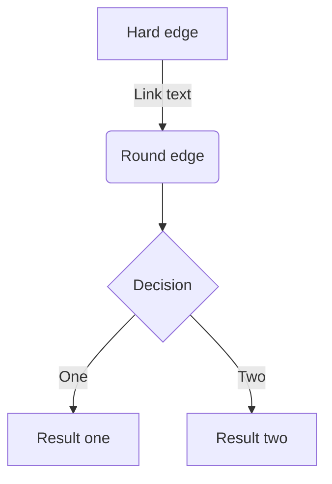

# Progrust Libraryで利用可能なMarkdown記法一覧

執筆者向けの記法カタログ。各記法の実装方式・雛形コード・落とし穴は `../markdown-pipeline/README.md` を参照。

## 見出し

```md
# 見出し1
## 見出し2
### 見出し3
#### 見出し4
```

> [!info] 補足
> 「見出し1」は基本的に使わず、frontmatterのtitleに設定する。
> ただし、記法としては有効

## リスト

```md
- Hello!
- Hola!
  - Bonjour!
```

## 番号付きリスト

```md
1. First
2. Second
```

## チェックリスト

```md
- [ ] 納豆
- [x] キムチ
```

## テキストリンク

```md
[アンカーテキスト](リンクのURL)
```

通常のリンク。

## リンクカード

```md
https://www.google.com/
```

段落の唯一の子が「http～」などから始まるURL文字列のリンクの場合、リンクカードとして表示される。

## 辞書リンク

```md
[[ownership]]
```

辞書コンテンツページのみに指定可能な特別なリンク。
対象の辞書コンテンツのファイル名を指定する。
存在しない辞書コンテンツや辞書コンテンツ以外に使用するとビルドエラーとなる。

> [!note]
> 辞書の一覧は開発サーバ起動時に読み込まれるため、`astro dev` 実行中に辞書mdを新規追加しても**サーバを再起動するまで**wikilinkの解決に反映されない（新しい辞書へのリンクがリンク切れ扱いになる）。

## 画像

```md

```

### 画像の幅やキャプションを指定する

```md
:::figure[キャプションテキスト]{width=480}

:::
```

画像の幅やキャプションを指定する場合は`:::figure`で画像リンクを囲う。
画像サイズやキャプションは省略可能

## テーブル

```md
| Head | Head | Head |
| ---- | ---- | ---- |
| Text | Text | Text |
| Text | Text | Text |
```

## コードブロック

> \```rust
> 
> \```

### ファイル名を表示する

> \```rust:ファイル名
> 
> \```

### diff のシンタックスハイライト

```rust
fn main() {
    let x = 1; // [!code --]
    let x = 2; // [!code ++]
}
```

diff のシンタックスハイライトを指定する場合、削除行は`// [!code --]`、追加行は`// [!code ++]`をそれぞれ行の末尾に記載する。
なお、コメント記号（`//`や`#`）は言語に応じて切り替える。

## 引用

```md
> 引用文
> 引用文
```

## 注釈

```md
脚注の例[^1]です。

[^1]: 脚注の内容その1
```

インライン型（`^[内容]`）は使えない（SätteriのGFM脚注は参照型のみ対応）。

## 区切り線

```md
---
```

## インラインスタイル

```md
*イタリック*
**太字**
~~打ち消し線~~
インラインで`code`を挿入する
```

## インラインのコメント

```md
<!-- TODO: ◯◯について追記する -->
```

HTMLのコメント記法を使用する

## メッセージ

> [!warning]
> 種別は必ず`{...}`の属性記法で、タイトルは必ず`[...]`のlabel記法で書くこと。

### 通常

```md
:::message
メッセージをここに
:::
```

### info

```md
:::message{info}
メッセージをここに
:::
```

### tip

```md
:::message{tip}
メッセージをここに
:::
```

### question

```md
:::message{question}
メッセージをここに
:::
```

### success

```md
:::message{success}
メッセージをここに
:::
```

### warning

```md
:::message{warning}
メッセージをここに
:::
```

### danger

```md
:::message{danger}
メッセージをここに
:::
```

### タイトルを指定する

```md
:::message[タイトルテキスト]{info}
メッセージをここに
:::
```

`[タイトル]`でメッセージのタイトルを任意のテキストにできる。

- すべての種別（および種別なしの`:::message[タイトル]`）と併用可能
- タイトルは省略可能。省略した場合は従来どおりタイトルなしで表示される

## アコーディオン

> [!warning]
> タイトルは必ず`[タイトル]`のlabel記法で書くこと。`:::details タイトル`のようにスペース区切りで書くと、タイトルが**エラーにならずに黙って消える**。

```md
:::details[タイトル]
折りたたまれる内容
:::
```

### `:::`の要素をネストさせる

```md
::::details[タイトル]
:::message
ネストされた要素
:::
::::
```

外側の要素の`:`を1つ増やす

## mermaid



mermaid.jsに準拠
